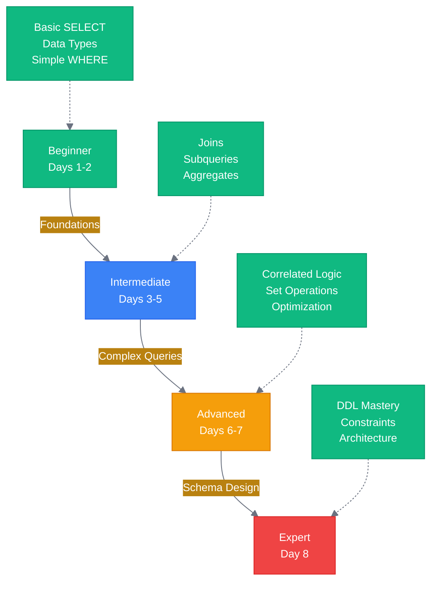

```mermaid
%%{init: {
  "theme": "base",
  "themeVariables": {
    "primaryColor": "#1e3a8a",
    "primaryTextColor": "#fff",
    "primaryBorderColor": "#1e40af",
    "lineColor": "#3b82f6",
    "secondaryColor": "#dbeafe",
    "tertiaryColor": "#eff6ff",
    "fontSize": "14px"
  }
}}%%

graph LR
    A[Day 01<br/>Foundations] --> B[Day 02<br/>DQL Basics]
    B --> C[Day 03<br/>Operators]
    C --> D[Day 04<br/>Functions & Aggregates]
    D --> E[Day 05<br/>Subqueries & Joins]
    E --> F[Day 06<br/>Advanced Joins & Sets]
    F --> G[Day 07<br/>Correlated Logic]
    G --> H[Day 08<br/>DDL & Schema Design]
    
    style A fill:#1e3a8a,stroke:#1e40af,color:#fff
    style B fill:#2563eb,stroke:#3b82f6,color:#fff
    style C fill:#3b82f6,stroke:#60a5fa,color:#fff
    style D fill:#60a5fa,stroke:#93c5fd,color:#000
    style E fill:#93c5fd,stroke:#bfdbfe,color:#000
    style F fill:#dbeafe,stroke:#eff6ff,color:#000
    style G fill:#eff6ff,stroke:#dbeafe,color:#000
    style H fill:#f0f9ff,stroke:#e0f2fe,color:#000
```

# 🗄️ SQL Mastery: From Fundamentals to Advanced Database Engineering

<div align="center">


[](https://github.com/Avinash-706)

</div>

<div align="center">


### 📚 A Comprehensive SQL Learning Repository
**Structured Day-by-Day Journey from Basics to Advanced Database Concepts**

<p>
<a href="#-about-this-repository">About</a> •
<a href="#-learning-path">Learning Path</a> •
<a href="#-day-wise-breakdown">Day-wise Breakdown</a> •
<a href="#-key-features">Features</a> •
<a href="#-technologies--databases">Technologies</a> •
<a href="#-connect-with-me">Connect</a>
</p>

</div>

---

## 👨‍💻 About This Repository

This repository documents my **comprehensive journey** through SQL and Relational Database Management Systems. It's designed as a **structured learning path** that progresses from fundamental concepts to advanced database engineering techniques.

### 🎯 What Makes This Repository Unique?

- **📖 Deep Conceptual Understanding**: Not just queries, but the *why* and *how* behind SQL execution
- **🏗️ Architecture-First Approach**: Focus on internal execution flows and database internals
- **🔄 Multi-Database Coverage**: Syntax and patterns for Oracle, MySQL, PostgreSQL, and SQL Server
- **📊 Visual Learning**: Mermaid diagrams, execution flow charts, and architectural visualizations
- **💼 Interview-Ready**: Each day includes advanced interview questions and real-world scenarios
- **🧪 Hands-On Practice**: Practical queries with detailed explanations and test data

### 🎓 Learning Philosophy

> "Understanding the execution engine is more valuable than memorizing syntax."

This repository emphasizes:
- **Internal Execution Mechanics** over surface-level syntax
- **Performance Implications** of different query patterns
- **Relational Algebra** foundations
- **Real-World Application** scenarios

---

## 🗺️ Learning Path

<div align="center">


</div>



---

## 📅 Day-wise Breakdown

### 🔷 [Day 01: Database Foundations](./day01/)
**Core Concepts Covered:**
- Data Anatomy & CRUD Operations
- DBMS vs RDBMS Architecture
- Codd's 12 Rules for Relational Databases
- Data Types & Constraint Fundamentals
- Database Cylinder Representation

**Key Takeaway:** Understanding the architectural foundation of relational databases and why constraints matter.

---

### 🔷 [Day 02: DQL Anatomy & Execution Order](./day02/)
**Core Concepts Covered:**
- SQL Sub-languages (DDL, DML, DCL, TCL)
- DQL Anatomy: Projection vs Selection
- Backend Order of Execution (FROM → WHERE → SELECT)
- Query Optimization Basics

**Key Takeaway:** How SQL engines process queries internally—the execution order is NOT the written order.

**Visual Aid:**
- Projection vs Selection Diagram
- Execution Flow Architecture

---

### 🔷 [Day 03: Operators & Logical Expressions](./day03/)
**Core Concepts Covered:**
- Arithmetic Operators (+, -, *, /, %)
- Relational Operators (=, !=, <, >, <=, >=)
- Logical Operators (AND, OR, NOT)
- Special Operators (IN, LIKE, BETWEEN, IS NULL)
- Operator Precedence & Evaluation Order

**Key Takeaway:** Mastering operator precedence prevents logical errors in complex WHERE clauses.

**Practical Queries:** 25+ operator-based queries with real-world scenarios

---

### 🔷 [Day 04: Functions, Aggregates & Subqueries](./day04/)
**Core Concepts Covered:**
- Single-Row Functions (String, Numeric, Date)
- Multi-Row Functions (COUNT, SUM, AVG, MAX, MIN)
- GROUP BY Architecture & Internal Execution
- HAVING vs WHERE (Filter Timing)
- Introduction to Subqueries

**Key Takeaway:** Understanding when aggregation happens in the execution pipeline.

**Visual Aids:**
- Single vs Multi-Row Function Comparison
- WHERE vs HAVING Execution Flow
- CONCAT Function Mechanics

---

### 🔷 [Day 05: Subqueries, Joins & Relationships](./day05/)
**Core Concepts Covered:**
- Subquery Operators (ALL, ANY, SOME)
- Unary Relationships (Employee-Manager Hierarchy)
- Join Fundamentals (Cartesian, Inner, Natural, Self)
- Outer Joins (Left, Right, Full)
- Oracle Legacy Syntax (+)

**Key Takeaway:** Joins are the bridge that reconstructs normalized data.

**Visual Aids:**
- Unary Relationship Diagram
- Join Execution Flow (Nested Loop)
- SQL Joins Venn Diagram

**Interview Questions:** 15 advanced join scenarios

---

### 🔷 [Day 06: Advanced Joins, Set Theory & Correlated Logic](./day06/)
**Core Concepts Covered:**
- Self Join (Recursive Hierarchies)
- Full Outer Join Engineering (MySQL Workaround)
- Set Operators (UNION, INTERSECT, MINUS/EXCEPT)
- Numeric Functions (ROUND, TRUNC, FLOOR, CEIL, MOD)
- Correlated Subqueries (The Loop Pattern)

**Key Takeaway:** Set operators merge results vertically; understanding their internal sort-merge mechanics.

**Visual Aids:**
- MySQL Full Join Workaround Diagram
- Correlated Subquery Execution Loop
- Set Operators Venn Diagram

**Performance Analysis:** Correlated Subquery vs Join benchmarking

---

### 🔷 [Day 07: Nth Highest/Lowest & String Engineering](./day07/)
**Core Concepts Covered:**
- Nth Highest/Lowest Salary Patterns (Without Window Functions)
- Correlated Subquery Ranking Logic
- Department-wise Ranking
- String Manipulation (SUBSTR, REPLACE, LENGTH)
- Character Counting Techniques
- DDL Introduction (CREATE, RENAME, Foreign Keys)

**Key Takeaway:** Classical ranking approach using correlated logic—understanding the counting mechanism.

**Visual Aids:**
- Nth Highest Execution Flow Diagram
- Step-by-Step Ranking Logic

**Practical Queries:** 10+ ranking patterns (4th highest, 5th minimum, top N, etc.)

---

### 🔷 [Day 08: DDL Mastery & Schema Design](./day08/)
**Core Concepts Covered:**
- DDL vs DML (The Fundamental Divide)
- Table Inspection (SHOW, DESCRIBE, SHOW CREATE TABLE)
- ALTER TABLE Operations (MODIFY, ADD, DROP, RENAME)
- Constraint Architecture (PRIMARY KEY, FOREIGN KEY, UNIQUE, CHECK, NOT NULL)
- Referential Integrity & CASCADE Options
- Relationship Patterns (1:N, M:N with Junction Tables)
- AUTO_INCREMENT Identity Columns
- DROP vs TRUNCATE vs DELETE

**Key Takeaway:** Schema design is the foundation of data integrity—constraints enforce business rules at the database level.

**Practical Implementation:** Complete Customer-Product system with referential integrity

---

## 🎯 Key Features

<div align="center">


</div>

### 📚 Comprehensive Documentation
- **Detailed Explanations**: Every concept explained with the "why" behind it
- **Execution Flow Diagrams**: Visual representation of how SQL engines process queries
- **Multi-Database Syntax**: Oracle, MySQL, PostgreSQL, SQL Server variations

### 🔬 Deep Technical Insights
- **Internal Execution Mechanics**: Understanding query optimization and execution plans
- **Performance Considerations**: Time complexity analysis and optimization strategies
- **Architectural Patterns**: Relational algebra foundations

### 💼 Interview Preparation
- **125+ Interview Questions**: Spread across all days
- **Tricky Scenarios**: Edge cases and common pitfalls
- **Real-World Problems**: Practical business logic implementation

### 🎨 Visual Learning
- **Mermaid Diagrams**: Execution flows, relationships, and architectures
- **Comparison Tables**: Side-by-side syntax and behavior comparisons
- **Data Scenarios**: Sample datasets for understanding query results

---

## 🛠️ Technologies & Databases

<div align="center">


| Database | Version | Coverage |
|:--------:|:-------:|:--------:|
| **MySQL** | 8.0+ | ✅ Primary |
| **Oracle** | 11g+ | ✅ Full |
| **PostgreSQL** | 12+ | ✅ Full |
| **SQL Server** | 2019+ | ✅ Syntax |

</div>

### 🔧 Tools Used
- **Database Clients**: MySQL Workbench, Oracle SQL Developer, pgAdmin
- **Version Control**: Git & GitHub
- **Documentation**: Markdown with Mermaid diagrams
- **Testing**: SCOTT schema (Oracle standard practice dataset)

---

## 📊 Repository Structure

```
SQL-Practice/
│
├── 📁 day01/          # Database Foundations
│   ├── infoDay01.md
│   └── DatabaseCyclinderRepresentation.jpg
│
├── 📁 day02/          # DQL Anatomy
│   ├── infoDay02.md
│   └── ProjectVsSelection.png
│
├── 📁 day03/          # Operators
│   ├── queries.sql
│   └── README.md
│
├── 📁 day04/          # Functions & Aggregates
│   ├── query.sql
│   ├── README.md
│   └── [Visual Aids]
│
├── 📁 day05/          # Subqueries & Joins
│   ├── query.sql
│   ├── README.md
│   └── UnaryRelationship_01.png
│
├── 📁 day06/          # Advanced Joins & Sets
│   ├── query.sql
│   ├── README.md
│   └── CoRelatedSubquery.png
│
├── 📁 day07/          # Correlated Logic & Strings
│   ├── query.sql
│   └── README.md
│
├── 📁 day08/          # DDL & Schema Design
│   ├── query.sql
│   ├── QUERY1.SQL
│   └── README.md
│
├── favicon.png        # Repository Icon
└── README.md          # This File
```

---

## 🚀 How to Use This Repository

<div align="center">


</div>

### For Learners:
1. **Sequential Learning**: Start from Day 01 and progress chronologically
2. **Hands-On Practice**: Execute queries in your local database environment
3. **Understand, Don't Memorize**: Focus on execution logic, not syntax
4. **Experiment**: Modify queries and observe behavior changes

### For Interviewers/Recruiters:
- **Depth of Knowledge**: Notice the focus on internal mechanics, not just syntax
- **Problem-Solving Approach**: Each day builds on previous concepts systematically
- **Documentation Skills**: Clear, professional technical writing
- **Multi-Database Proficiency**: Cross-platform SQL expertise

### For Contributors:
- Fork the repository
- Add your own queries or improvements
- Submit pull requests with detailed explanations
- Follow the established documentation style

---

## 📈 Learning Outcomes

By completing this repository, you will:

✅ **Understand** SQL execution internals and query optimization<br>
✅ **Master** complex joins, subqueries, and set operations<br>
✅ **Design** normalized database schemas with proper constraints<br>
✅ **Write** efficient, production-ready SQL queries<br>
✅ **Debug** query performance issues<br>
✅ **Ace** SQL technical interviews<br>
✅ **Work** confidently with Oracle, MySQL, PostgreSQL, and SQL Server<br>

---

## 🎓 Skill Progression



---

## 💡 Best Practices Learned

### Query Optimization
- Always use `DISTINCT` in COUNT for ranking queries
- Prefer JOINs over Correlated Subqueries for large datasets
- Use `EXISTS` instead of `IN` for better performance
- Avoid `SELECT *` in production code

### Schema Design
- Enforce business rules at the database level with constraints
- Use Foreign Keys for referential integrity
- Normalize to 3NF, denormalize only when necessary
- Index foreign key columns for join performance

### Code Quality
- Use meaningful table and column aliases
- Comment complex queries
- Follow consistent naming conventions
- Test with edge cases (NULL values, empty sets)

---

## 🌟 Highlights & Achievements

<div align="center">


</div>

- **📝 8 Days** of structured learning
- **📄 1000+ Lines** of documented SQL queries
- **🎨 25+ Diagrams** for visual understanding
- **❓ 125+ Interview Questions** with detailed answers
- **🔄 Multi-Database** syntax coverage
- **🏗️ Production-Ready** schema design patterns

<div align="center">

### 📊 Repository Statistics


</div>

</div>

---

## 🤝 Connect With Me

<div align="center">


### Avinash Dhanuka

**Database Engineer | SQL Specialist | Backend Developer**


[](mailto:avunashdhanuka@gmail.com)
[](https://github.com/Avinash-706)
[](https://avinashdhanuka.vercel.app/)


**📧 Email:** [avunashdhanuka@gmail.com](mailto:avunashdhanuka@gmail.com)


</div>

### 💬 Let's Discuss:
- Database Architecture & Optimization
- SQL Performance Tuning
- Backend Development
- System Design
- Career Opportunities

<div align="center">

### 💎 Code Quality & Best Practices

<div align="center">


</div>

### 📊 Repository Insights

<div align="center">


</div>

</div>

</div>

---

## 📜 License & Usage

<div align="center">

[](https://opensource.org/licenses/MIT)
[](https://creativecommons.org/licenses/by/4.0/)
[](https://opensource.org/)

**Copyright © 2026 Avinash Dhanuka**

This repository is licensed under the **MIT License** - you are free to use, modify, and distribute this code with attribution.  
Educational content is also available under **Creative Commons Attribution 4.0 International (CC BY 4.0)**.

📖 [View Full License](./LICENSE) • 🎓 [Educational Use Guidelines](./LICENSE-CC-BY)

</div>

---

## 🙏 Acknowledgments

- **Oracle SCOTT Schema**: Standard practice dataset
- **SQL Community**: For best practices and patterns
- **Database Documentation**: Oracle, MySQL, PostgreSQL official docs

---

## 📌 Quick Links

- [Start Learning (Day 01)](./day01/)
- [Advanced Topics (Day 06-08)](./day06/)
- [Interview Questions Collection](#-day-wise-breakdown)
- [Contact Me](#-connect-with-me)

---

<div align="center">


### ⭐ If you find this repository helpful, please consider giving it a star!


### 🎯 Learning Never Stops


<br/>


**Made with ❤️ and ☕ by Avinash Dhanuka**

### 📬 Stay Connected

<a href="mailto:avunashdhanuka@gmail.com">
  
</a>
<a href="https://avinashdhanuka.vercel.app/">
  
</a>
<a href="https://github.com/Avinash-706">
  
</a>

<br/><br/>


*Last Updated: February 2026*

</div>
