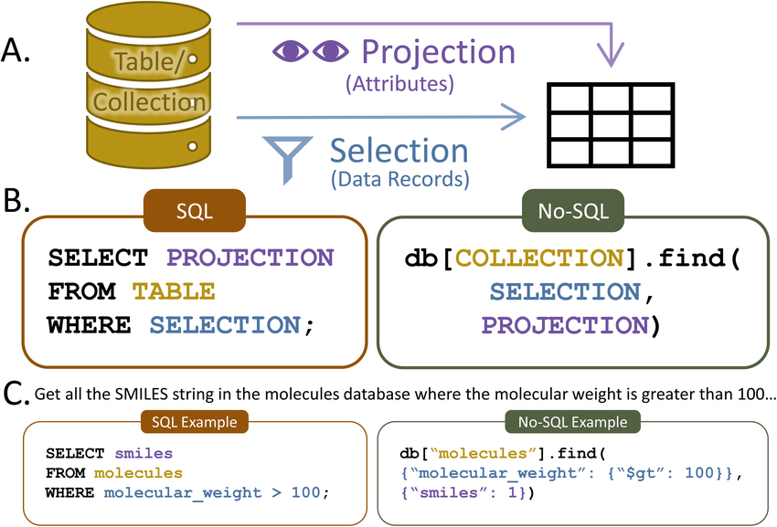
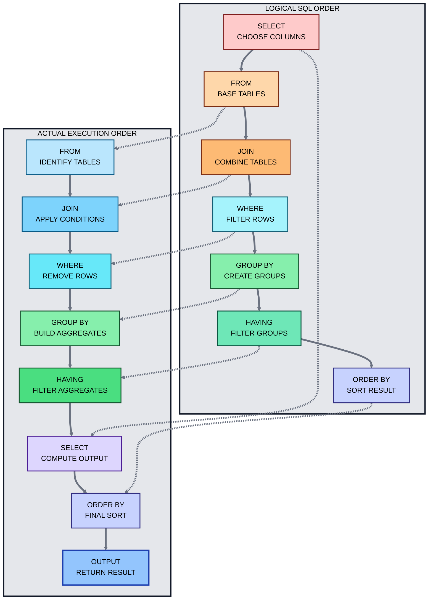

# 🗄️ Master Guide: SQL Statements & Execution Flow

<div align="center">


</div>

<hr style="border: 1px solid rgb(98, 117, 187)">

<div align="center">
<table>
<tr>
<td align="center">
<br />

<h3>© 2025 Avinash Dhanuka</h3>
<p>Master Guide: SQL Statements & Internals</p>
<p><em>Crafted with ❤️ for Data Consistency, Integrity & Performance</em></p>

<a href="https://mail.google.com/mail/?view=cm&fs=1&to=avunashdhanuka@gmail.com&su=SQL%20Execution%20Flow%20Query&body=🗄️%20Hello%20Avinash,%0D%0A%0D%0AMy%20name%20is%20[Your%20Name]%20and%20I%20have%20a%20question%20regarding%20SQL%20Order%20of%20Execution.%0D%0A%0D%0A🔹%20Doubt:%20[Enter%20your%20doubt]%0D%0A%0D%0AThank%20you!" target="_blank">


</a>
<br />
<br />
</td>
</tr>
</table>
</div>

> **Author's Note:** This guide breaks down the sub-languages of SQL and performs a deep dive into the **DQL (SELECT)** statement, explaining exactly how the Oracle Engine processes your query step-by-step.

---

## 📑 Table of Contents
1.  [SQL Sub-Languages (DDL, DML, TCL, DCL, DQL)](#1-sql-sub-languages-classification)
2.  [The Anatomy of DQL (SELECT)](#2-the-anatomy-of-dql-select)
    -   [Projection vs Selection vs Joins](#visualizing-projection-vs-selection)
3.  [Projection: Selecting Columns](#3-projection-selecting-columns)
    -   [Expressions](#expressions-calculating-data)
    -   [Aliases](#aliases-renaming-outputs)
    -   [DISTINCT](#distinct-removing-duplicates)
4.  [Selection: Filtering Rows (WHERE)](#4-selection-filtering-rows-where-clause)
    -   [SQL Operators](#sql-operators-the-missing-link)
5.  [Backend Internals: Order of Execution](#5-backend-internals-order-of-execution)
6.  [Top Interview Questions](#6-top-interview-questions-from-this-topic)

---

## 1. SQL Sub-Languages Classification

SQL is not just one thing; it is a collection of commands grouped by their purpose.

<p align="center">
  
</p>

| Acronym | Full Form | Purpose | Key Commands |
| :--- | :--- | :--- | :--- |
| **DDL** | **Data Definition Language** | Used to define or alter the *structure* (schema) of the database. | `CREATE`, `ALTER`, `DROP`, `TRUNCATE`, `RENAME` |
| **DML** | **Data Manipulation Language** | Used to manipulate the *data* inside the tables. | `INSERT`, `UPDATE`, `DELETE` |
| **TCL** | **Transaction Control Language** | Used to manage the changes made by DML statements (Save/Undo). | `COMMIT`, `ROLLBACK`, `SAVEPOINT` |
| **DCL** | **Data Control Language** | Used to control access and permissions. | `GRANT` (Give access), `REVOKE` (Remove access) |
| **DQL** | **Data Query Language** | Used to *retrieve* data. It performs 3 major operations: <br> 1. **Projection** <br> 2. **Selection** <br> 3. **Joins** | `SELECT` |

---

## 2. The Anatomy of DQL (SELECT)

The `SELECT` statement is the most powerful command in SQL. It performs three specific operations to get you exactly the data you need.

### 🔹 1. Projection (Vertical Slicing ⬇️)
*   **Definition:** Retrieving data by selecting **only specific columns**.
*   *Action:* Discards unwanted columns.
*   *Example:* "Give me only Names and Emails of all students."

### 🔹 2. Selection (Horizontal Slicing ➡️)
*   **Definition:** Retrieving data by selecting **specific rows** based on a condition.
*   *Action:* Discards unwanted rows.
*   *Example:* "Give me details of students who scored > 90 marks."

### 🔹 3. Joins (Merging 🔗)
*   **Definition:** Retrieving data from **multiple tables** simultaneously by linking them.
*   *Action:* Combines data sources.

### 🖼️ Visualizing Projection vs Selection

<p align="center">
  
</p>

*   **π (Pi - Projection):** Selects Columns (Vertical).
*   **σ (Sigma - Selection):** Selects Rows (Horizontal).

---

## 3. Projection: Selecting Columns

**Syntax:**
```sql
SELECT [DISTINCT] Column_Name / Expression [AS Alias] 
FROM Table_Name;
```

### Expressions (Calculating Data)
**Definition:** An expression is a combination of symbols and operators that the SQL engine evaluates to produce a single data value.
*   **Key Concept:** Expressions allow you to manipulate data *during* retrieval without changing the actual data in the database.

**Types of Expressions:**
1.  **Arithmetic:** `SELECT SALARY + 1000 FROM EMP;` (Adds bonus virtually).
2.  **String:** `SELECT FIRST_NAME || ' ' || LAST_NAME FROM EMP;` (Joins names).
3.  **Constant:** `SELECT NAME, 'Active' FROM STUDENT;` (Adds a hardcoded column 'Active' to every row).

### Aliases (Renaming Outputs)
**Definition:** An alternative temporary name given to a Column or an Expression in the result table.

**Rules for Aliases:**
1.  **Optional Keyword:** You can use `AS` or simply put a space.
    *   `SELECT Name AS Student_Name` ✅
    *   `SELECT Name Student_Name` ✅
2.  **Single Word:** Default aliases must be one word.
3.  **Multiple Words:** If you want a space (e.g., "Full Name"), you **MUST** enclose it in **Double Quotes (`" "`)**.
    *   `SELECT Name AS "Full Name"` ✅
4.  **Oracle Specific:** Oracle converts all unquoted aliases to UPPERCASE. Double quotes preserve case sensitivity.

### DISTINCT (Removing Duplicates)
**Definition:** A clause used to remove duplicated or repeated values from the result set.

**Critical Rules:**
1.  **First Argument Only:** `DISTINCT` must be the **very first word** after `SELECT`.
    *   ❌ `SELECT Name, DISTINCT Age FROM Student;` (Invalid SQL)
    *   ✅ `SELECT DISTINCT Name, Age FROM Student;` (Valid)
2.  **Combination Logic:** When used with multiple columns, it checks for **Unique Combinations**.
    *   Row 1: `(A, 10)` | Row 2: `(A, 10)` → **Removed** (Duplicate).
    *   Row 1: `(A, 10)` | Row 2: `(A, 20)` → **Kept** (Unique combination).

---

## 4. Selection: Filtering Rows (WHERE Clause)

**Syntax:**
```sql
SELECT * / Columns 
FROM Table_Name 
WHERE <Filter_Condition>;
```

### The WHERE Clause
*   It is used to filter records.
*   It executes **Row by Row**.
*   It restricts data *before* it is shown to the user.
*   We can combine multiple conditions using Logical Operators (`AND`, `OR`).

### SQL Operators (The Missing Link)
To use the `WHERE` clause effectively, you need Operators.

| Category | Operator | Meaning | Example |
| :--- | :--- | :--- | :--- |
| **Relational** | `=`, `!=` or `<>` | Equal / Not Equal | `Age = 25` |
| | `>`, `<`, `>=`, `<=` | Greater/Less than | `Salary > 5000` |
| **Logical** | `AND` | Both conditions must be True | `Age > 18 AND City = 'Pune'` |
| | `OR` | Any one condition is True | `City = 'Pune' OR City = 'Mumbai'` |
| | `NOT` | Reverses the condition | `NOT (Age > 18)` |
| **Special** | `BETWEEN` | Range of values (Inclusive) | `Salary BETWEEN 1000 AND 5000` |
| | `IN` | Match any value in a list | `City IN ('Delhi', 'Pune', 'Goa')` |
| | `LIKE` | Pattern Matching | `Name LIKE 'S%'` (Starts with S) |
| | `IS NULL` | Checks for Empty/Null values | `Phone IS NULL` |


<p align="center">
  
</p>

---

## 5. Backend Internals: Order of Execution

Understanding "How" the database thinks is critical for writing fast queries. The SQL Engine **DOES NOT** read top-to-bottom like a human. It reads in a specific logical order.

### 🖼️ The Execution Flow Diagram



#### Detailed Breakdown:

1.  **The `FROM` Clause (Identify Data)**
    *   **Action:** The database goes to the hard disk, searches for the specific `Table_Name`, and loads the data into the buffer (memory).
    *   *Result:* The entire table (all rows, all columns) is available to the engine.

2.  **The `WHERE` Clause (Filter Data)**
    *   **Action:** The engine goes through the table in memory **row by row**. It checks the condition.
        *   If `True` → Keep the row.
        *   If `False` → Discard the row immediately.
    *   *Result:* A filtered set of rows.

3.  **The `SELECT` Clause (Project Data)**
    *   **Action:** Now that we have the correct rows, the engine looks at the columns you requested. It discards unneeded columns, computes any **Expressions**, and assigns **Aliases**.
    *   *Result:* The final table structure.

> **⚡ Important Note:** Because `WHERE` runs **before** `SELECT`, you **cannot** use an Alias created in `SELECT` inside the `WHERE` clause.
> *   ❌ `SELECT Salary AS Sal FROM Emp WHERE Sal > 5000` (Error: 'Sal' invalid identifier)

---

## 6. Top Interview Questions (From this Topic)

#### Q1: What is the Order of Execution for a basic SQL Query?
> **Answer:** 1. `FROM` (Data Identification) → 2. `WHERE` (Row Filtering) → 3. `SELECT` (Column Projection / Expressions / Aliasing).

#### Q2: Can we use an Alias in the WHERE clause?
> **Answer:** **No.** Because the `WHERE` clause executes *before* the `SELECT` clause (where the alias is defined), the database doesn't know the alias exists yet.

#### Q3: What is the difference between Selection and Projection?
> **Selection** (using `WHERE`) filters rows horizontally. **Projection** (using `SELECT`) filters columns vertically.

#### Q4: Does `DISTINCT` apply to the first column or all columns?
> **Answer:** It applies to the **entire row** (combination of all columns mentioned). `SELECT DISTINCT A, B` means unique pairs of A and B.

---
*Created for Advanced SQL Learning.*