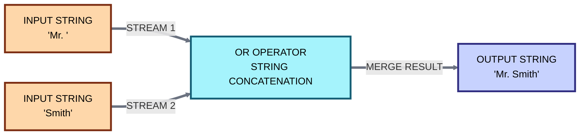
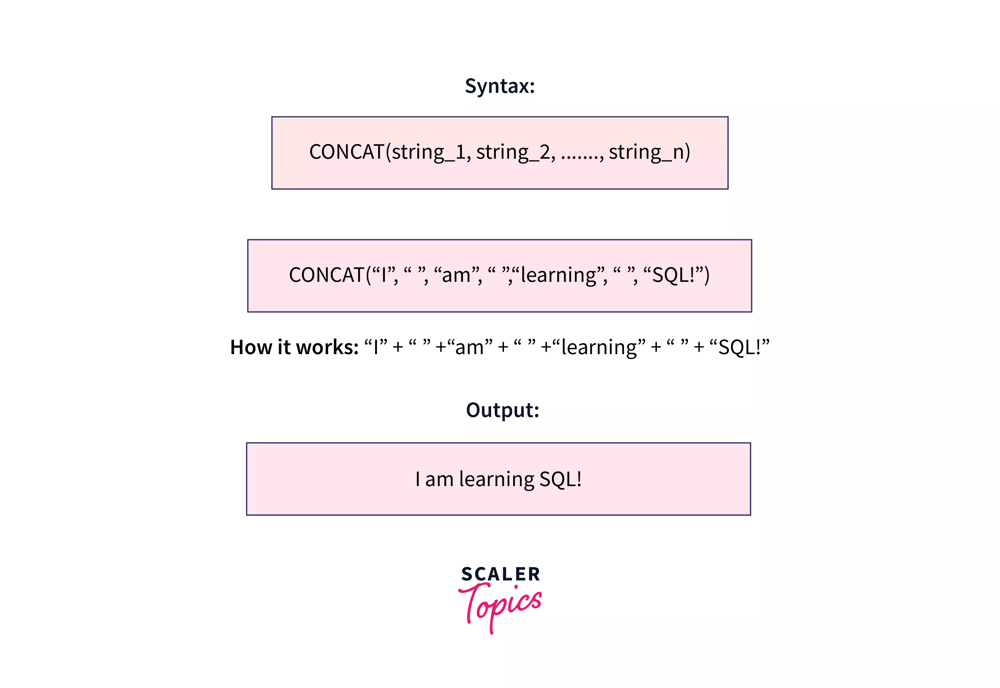
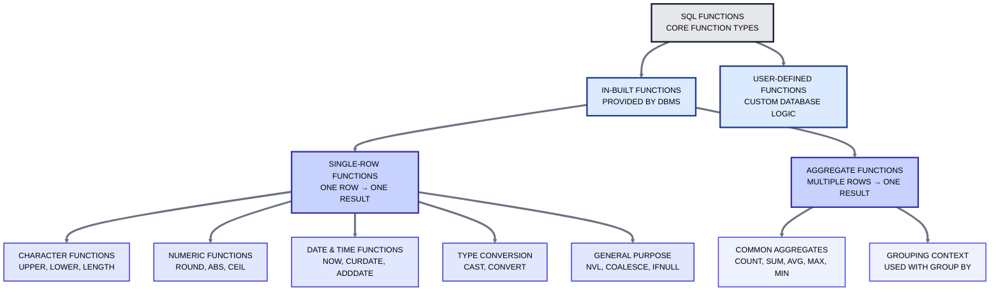
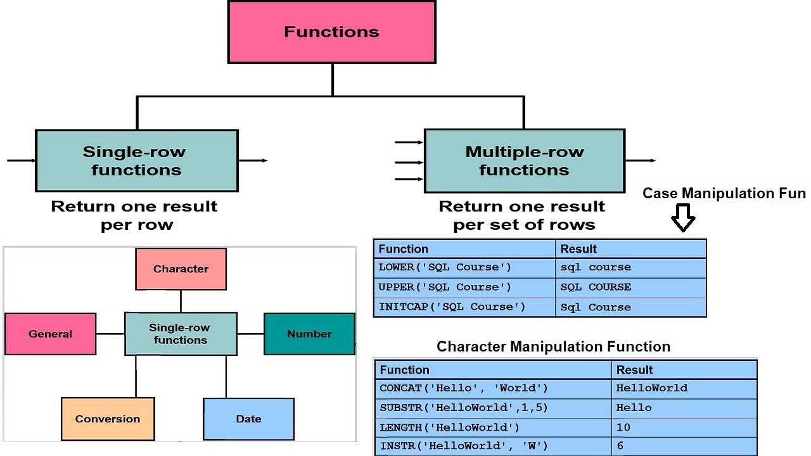
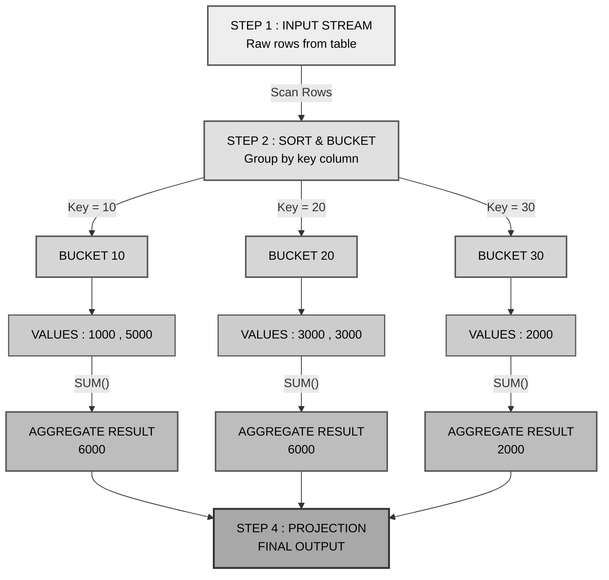
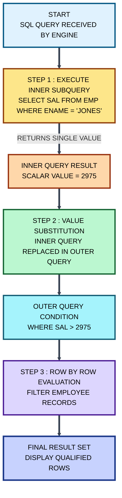
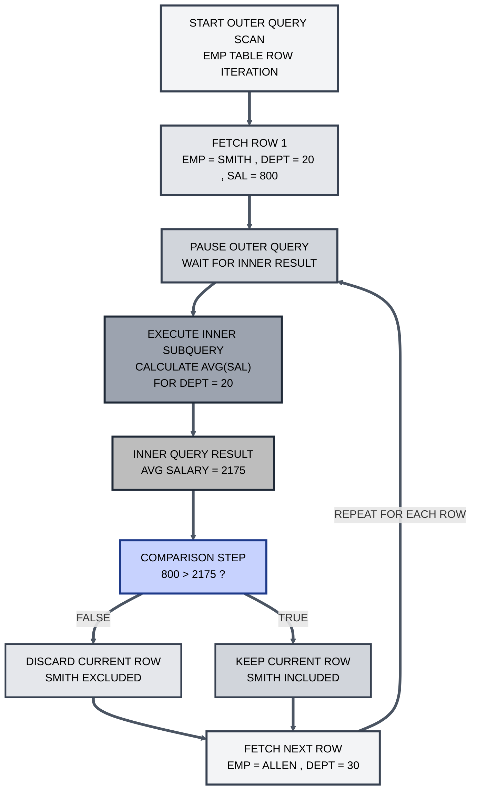

# 🗄️ Master Guide: Advanced SQL Operators, Functions & Execution Internals

<div align="center">


</div>

<hr style="border: 1px solid rgb(98, 117, 187)">

<div align="center">
<table>
<tr>
<td align="center">
<br />

<h3>© 2025 Avinash Dhanuka</h3>
<p>Master Guide: Advanced SQL Logic</p>
<p><em>Crafted with ❤️ for Internal Engine Architecture</em></p>

<a href="https://mail.google.com/mail/?view=cm&fs=1&to=avunashdhanuka@gmail.com&su=SQL%20Internals:%20Group%20By%20%26%20Subquery%20Inquiry&body=🗄️%20Hello%20Avinash,%0D%0A%0D%0AMy%20name%20is%20[Your%20Name]%20and%20I%20was%20reviewing%20your%20Advanced%20Guide%20on%20SQL%20Execution%20Flow.%0D%0A%0D%0A🔹%20Specific%20Topic:%20[e.g.,%20Correlated%20Subquery%20/%20Group%20By%20Bucket%20Logic]%0D%0A🔹%20The%20Scenario:%20[Describe%20the%20logic%20or%20query%20you%20are%20struggling%20with]%0D%0A🔹%20Query:%20[Type%20your%20question%20here]%0D%0A%0D%0AThank%20you%20for%20the%20detailed%20notes!%0D%0A%0D%0ABest%20regards,%0D%0A[Your%20Name]" target="_blank">


</a>
<br />
<br />
</td>
</tr>
</table>
</div>

> **Author's Note:** This document is a deep dive into the SQL Engine. We move beyond syntax to understand **Three-Valued Logic**, **Aggregation Buckets**, and the complex dependency chains of **Correlated Subqueries**.

---

## 📑 Table of Contents
1.  [IS Operator: The State Checker](#1-is-operator-the-state-checker)
2.  [Pattern Matching (LIKE/NOT LIKE)](#2-pattern-matching-likenot-like)
3.  [Concatenation: Oracle vs The World](#3-concatenation-operator)
4.  [SQL Functions: Hierarchy & Types](#4-sql-functions-hierarchy--types)
5.  [Single Row Functions (Detailed)](#5-single-row-functions-detailed)
6.  [Multi-Row Functions (Aggregates)](#6-multi-row-functions-aggregates)
7.  [GROUP BY: Internal Bucket Architecture](#7-group-by-internal-bucket-architecture)
8.  [HAVING: The Post-Filter](#8-having-the-post-filter)
9.  [Subqueries: The Complete Guide](#9-subqueries-the-complete-guide)
    -   [Single Row Subqueries](#91-single-row-subqueries)
    -   [Multi-Row Subqueries (ANY/ALL)](#92-multi-row-subqueries)
    -   [Correlated Subqueries (The Loop)](#93-correlated-subqueries-the-loop)
10. [Top Interview Questions](#10--top-interview-questions)

---

## 1. IS OPERATOR: THE STATE CHECKER

### 🧠 Deep Concept: State vs. Value
The `IS` operator is **NOT** a comparison operator like `=`. It does not compare values (e.g., 5 vs 5). Instead, it checks the **State** or **Property** of the data.

### ⚠️ The "Three-Valued Logic" Problem
In SQL, a boolean expression can be: `TRUE`, `FALSE`, or `UNKNOWN`.
*   **NULL** represents Missing Information.
*   If you ask: *"Is the Unknown value in my pocket equal to the Unknown value in yours?"* (`NULL = NULL`)
*   The answer is: **UNKNOWN**.
*   SQL treats `UNKNOWN` as `FALSE` in a WHERE clause, so rows are rejected.

### 🔹 IS NULL
Explicitly checks if the data state is "Missing".
```sql
SELECT * FROM EMP WHERE COMM IS NULL;
```
*   **Execution:** The engine looks at the metadata flag of the cell. If the flag says "Empty", it returns TRUE.

### 🔹 IS NOT NULL
Explicitly checks if the data state is "Present".
```sql
SELECT * FROM EMP WHERE COMM IS NOT NULL;
```

---

## 2. PATTERN MATCHING (LIKE/NOT LIKE)

The `LIKE` operator is a **Pattern Matching Engine**. It scans strings character-by-character against a specific format.

### 🎭 The Wildcards

| Symbol | Name | Logic |
| :---: | :--- | :--- |
| `%` | **Percent** | Accepts **Zero**, **One**, or **Multiple** characters. |
| `_` | **Underscore** | Accepts **Exactly One** character. |

### 🧪 Complex Pattern Examples

| Pattern | Meaning | Example Match |
| :--- | :--- | :--- |
| `'A%'` | Starts with A | **A**pple, **A**dam |
| `'%A'` | Ends with A | Indi**a**, US**A** |
| `'%A%'` | Contains A anywhere | B**a**nana |
| `'_A%'` | **2nd Character** is A | J**a**mes (Skip J, match a) |
| `'__A%'` | **3rd Character** is A | Ab**a**cus |
| `'%A_'` | **2nd Last** is A | Tex**a**s (Ends in s, A before it) |
| `'____'` | Exactly 4 Chars | ABCD |

### 🚫 NOT LIKE
Rejects the pattern.
*   `WHERE ENAME NOT LIKE 'A%'` -> Returns names starting with B-Z.
*   **Trap:** `NOT LIKE '%'` returns **Zero Rows** (because `%` matches everything, so `NOT` rejects everything).

---

Here is the **detailed, standalone section** for the Concatenation Operator, specifically tailored to cover PostgreSQL, Oracle, and the Pipe (`||`) symbol usage in depth.

You can paste this directly into your existing `.md` file.

***

## 3. CONCATENATION OPERATOR

### 🧠 What is Concatenation?
Concatenation is the operation of **appending** (joining) one string to the end of another string. Think of it as "gluing" text columns together to create a single output column.

> **Analogy:** Like connecting two water pipes together to make one long pipe. The data flows from the first string immediately into the second.

---

### 🔗 The Pipe Operator (`||`)
The double vertical bar symbols `||` are known as **Pipes**.
*   **Status:** This is the **ANSI SQL Standard** operator for concatenation.
*   **Who uses it?** It is the native operator for **Oracle** and **PostgreSQL**.

### ⚔️ Database Comparison (Syntax Wars)

Different databases use different methods to achieve the same result.

| Database | Operator / Function | Syntax Example | Standard? |
| :--- | :--- | :--- | :--- |
| **Oracle** | `||` (Pipe) | `Col1 || Col2` | ✅ Yes |
| **PostgreSQL** | `||` (Pipe) | `Col1 || Col2` | ✅ Yes |
| **MySQL** | `CONCAT()` | `CONCAT(Col1, Col2)` | ❌ No |
| **SQL Server** | `+` (Plus) | `Col1 + Col2` | ❌ No |

---

### 🏭 Internal Execution Flow



---

### 🧪 Syntax & Examples

#### 1. Basic Joining (Oracle & PostgreSQL)
Joining a Title, First Name, and Last Name with spaces.

```sql
SELECT 'Mr. ' || FIRST_NAME || ' ' || LAST_NAME AS FULL_NAME
FROM EMPLOYEES;
```
*   **Input:** `First='John'`, `Last='Doe'`
*   **Output:** `Mr. John Doe`

#### 2. Mixing Data Types
Usually, you concatenate strings. If you concatenate a Number, the database implicitly converts it to a string first.

```sql
SELECT ENAME || ' earns $' || SAL AS SALARY_REPORT 
FROM EMP;
```
*   **Output:** `KING earns $5000`

---

### ⚠️ The NULL Trap (Critical Difference)

This is a favorite interview question. How does `||` handle **NULL** values?

#### Case A: Oracle SQL Behavior (Friendly)
Oracle treats `NULL` as an **Empty String** (`''`) during concatenation.
*   Query: `SELECT 'Hello' || NULL FROM DUAL;`
*   Result: **'Hello'**
*   *Logic:* It just ignores the missing part and keeps the rest.

#### Case B: PostgreSQL Behavior (Strict)
PostgreSQL follows strict logic. If one part is Unknown (NULL), the whole result is Unknown.
*   Query: `SELECT 'Hello' || NULL;`
*   Result: **NULL**
*   *Fix:* In Postgres, if you want to avoid this, use the `CONCAT` function (which ignores NULLs) or wrap columns in `COALESCE`.
    *   `SELECT CONCAT('Hello', NULL);` $\rightarrow$ `'Hello'`

### 🖼️ Visual Summary

<p align="center">
  
</p>
---


## 4. SQL FUNCTIONS: HIERARCHY & TYPES

A function is a stored logic block: **Input $\rightarrow$ Process $\rightarrow$ Output**.




### 🆚 Single Row vs. Multi-Row (Quick Comparison)

<p align="center">
  
</p>

| Feature | Single Row Function | Multi-Row (Aggregate) Function |
| :--- | :--- | :--- |
| **Input** | Accepts **One Row** at a time | Accepts **Multiple Rows** (Group) |
| **Output** | Returns **One Result** per row | Returns **One Result** per group |
| **Rows Returned** | Equal to input rows (N $\rightarrow$ N) | Less than input rows (N $\rightarrow$ 1) |
| **Example** | `UPPER('Avinash')` $\rightarrow$ 'AVINASH' | `SUM(10, 20, 30)` $\rightarrow$ 60 |

---

## 5. SINGLE ROW FUNCTIONS (DETAILED)

**Definition:** These functions operate on **every single row** individually. They process data row-by-row.

### 🔠 A. Character Functions
Used to manipulate string/text data.

| Function | Description | Syntax | Example | Result |
| :--- | :--- | :--- | :--- | :--- |
| **UPPER** | Converts to Uppercase | `UPPER(str)` | `UPPER('sql')` | `'SQL'` |
| **LOWER** | Converts to Lowercase | `LOWER(str)` | `LOWER('SQL')` | `'sql'` |
| **INITCAP** | Title Case (First Letter Capital) | `INITCAP(str)` | `INITCAP('mr john')` | `'Mr John'` |
| **LENGTH** | Counts number of characters | `LENGTH(str)` | `LENGTH('Admin')` | `5` |
| **SUBSTR** | Extracts a portion of a string | `SUBSTR(str, start, count)` | `SUBSTR('ORACLE', 2, 3)` | `'RAC'` |
| **INSTR** | Finds position of a character | `INSTR(str, char)` | `INSTR('APPLE', 'P')` | `2` |
| **TRIM** | Removes spaces from both sides | `TRIM(str)` | `TRIM('  Hi  ')` | `'Hi'` |
| **REPLACE** | Replaces specific characters | `REPLACE(str, old, new)` | `REPLACE('Jack', 'J', 'Bl')` | `'Black'` |

---

### 🔢 B. Numeric Functions
Used to perform mathematical operations on numbers.

| Function | Description | Syntax | Example | Result |
| :--- | :--- | :--- | :--- | :--- |
| **ROUND** | Rounds to nearest integer/decimal | `ROUND(num, places)` | `ROUND(10.5)` | `11` |
| **TRUNC** | Removes decimals without rounding | `TRUNC(num, places)` | `TRUNC(10.9)` | `10` |
| **MOD** | Returns Remainder of division | `MOD(num, divisor)` | `MOD(10, 3)` | `1` |
| **POWER** | Returns power of a number | `POWER(n, p)` | `POWER(2, 3)` | `8` |

> **⚠️ ROUND vs TRUNC:**
> *   `ROUND(10.9)` checks if .9 is >= .5, so it rounds **UP** to 11.
> *   `TRUNC(10.9)` simply **CUTS** the .9 part, resulting in 10.

---

### 📅 C. Date Functions
Used to manipulate Date data types.

| Function | Description | Example | Result |
| :--- | :--- | :--- | :--- |
| **SYSDATE** | Returns current System Date & Time | `SELECT SYSDATE FROM DUAL;` | `02-FEB-2026` |
| **ADD_MONTHS** | Adds 'N' months to a specific date | `ADD_MONTHS('01-JAN-23', 2)` | `01-MAR-23` |
| **MONTHS_BETWEEN** | Returns months between two dates | `MONTHS_BETWEEN('MAR', 'JAN')` | `2` |
| **NEXT_DAY** | Returns date of next specific weekday | `NEXT_DAY('01-JAN-23', 'SUNDAY')` | *(Next Sunday's Date)* |
| **LAST_DAY** | Returns the last date of that month | `LAST_DAY('01-FEB-23')` | `28-FEB-23` |

---

### 🛠️ D. General / Conversion Functions
Used for NULL handling and Data Type conversion.

| Function | Description | Syntax Example |
| :--- | :--- | :--- |
| **NVL** (Oracle) | If value is NULL, use alternate value. | `NVL(COMM, 0)` |
| **COALESCE** | Returns first Non-Null value in a list. | `COALESCE(Mobile, Landline, Email)` |
| **TO_CHAR** | Converts Number/Date to String. | `TO_CHAR(SYSDATE, 'MM')` |
| **TO_DATE** | Converts String to Date. | `TO_DATE('2023-01-01', 'YYYY-MM-DD')` |

---

## 6. MULTI-ROW FUNCTIONS (AGGREGATES)

**Definition:** These functions accept a set of rows (a group) as input and return a **single summary value** as output.
*   **Logic:** Many $\rightarrow$ One.

<p align="center">
  
</p>

### 1️⃣ MAX() - Maximum
*   **Description:** Returns the largest value in the column.
*   **Data Types:** Supports Number, String (Z > A), Date (Latest date).
*   **Syntax:** `MAX(Column_Name)`
*   **Example:** `SELECT MAX(SAL) FROM EMP;` (Finds Highest Salary).

### 2️⃣ MIN() - Minimum
*   **Description:** Returns the smallest value in the column.
*   **Data Types:** Supports Number, String (A < Z), Date (Oldest date).
*   **Syntax:** `MIN(Column_Name)`
*   **Example:** `SELECT MIN(HIREDATE) FROM EMP;` (Finds most senior employee).

### 3️⃣ SUM() - Summation
*   **Description:** Adds all values in the column.
*   **Data Types:** **Numbers ONLY**.
*   **Syntax:** `SUM(Column_Name)`
*   **Example:** `SELECT SUM(SAL) FROM EMP;` (Total Cost to Company).

### 4️⃣ AVG() - Average
*   **Description:** Calculates the Arithmetic Mean.
*   **Formula:** $\frac{\text{Sum of Values}}{\text{Count of Values}}$
*   **Data Types:** **Numbers ONLY**.
*   **Syntax:** `AVG(Column_Name)`
*   **Example:** `SELECT AVG(SAL) FROM EMP;`

### 5️⃣ COUNT() - Counter
*   **Description:** Returns the number of rows/records.
*   **Variations:**

| Variation | Behavior |
| :--- | :--- |
| `COUNT(*)` | Counts **Total Rows** (Including NULLs and Duplicates). |
| `COUNT(Column)` | Counts only **Non-Null** values in that column. |
| `COUNT(DISTINCT Col)` | Counts only **Unique, Non-Null** values. |

---

### 📜 CHARACTERISTICS OF MULTI-ROW FUNCTIONS (Deep Dive)

You must strictly follow these rules to avoid Errors (`ORA-00937`, `ORA-00934`).

#### 1. The Single Argument Rule
*   **Rule:** Aggregate functions accept only **one** column or expression as an argument.
*   **Reason:** Aggregation works vertically on one stream of data. It cannot sum two separate columns horizontally in the same function call.
*   ❌ **Wrong:** `SUM(SAL, COMM)` -> SQL does not know how to sum two lists simultaneously in one call.
*   ✅ **Right:** `SUM(SAL) + SUM(COMM)` -> Sums list A, Sums list B, then adds the results.

#### 2. The Projection Restriction (Cardinality Mismatch)
*   **Rule:** You cannot select a raw column along with a Multi-Row function, **unless** that column is in the `GROUP BY` clause.
*   **Reason:**
    *   `ENAME` returns **14 Rows**.
    *   `SUM(SAL)` returns **1 Row**.
    *   SQL cannot display 14 rows and 1 row in the same table grid. It's a matrix mismatch.
*   ❌ **Wrong:** `SELECT ENAME, SUM(SAL) FROM EMP;`
*   ✅ **Right:** `SELECT DEPTNO, SUM(SAL) FROM EMP GROUP BY DEPTNO;`

#### 3. NULL Handling (The Ignore Rule)
*   **Rule:** Multi-row functions **automatically ignore NULL cells**.
*   **Impact:**
    *   Data: `[10, 20, NULL]`
    *   `SUM` = 30
    *   `COUNT` = 2
    *   `AVG` = $30 / 2 = 15$
*   **Note:** If you want to treat NULL as 0 for Average, you must use `AVG(NVL(COMM, 0))`. This changes the calculation to $30 / 3 = 10$.

#### 4. WHERE Clause Restriction
*   **Rule:** You **cannot** pass Multi-Row functions inside the `WHERE` clause.
*   **Reason:** The Order of Execution.
    *   `WHERE` executes **Row-by-Row** to filter data *before* grouping.
    *   Multi-Row functions execute **Group-by-Group** *after* grouping.
    *   The `WHERE` clause cannot check a "Sum" because the sum hasn't been calculated yet.
*   ❌ **Wrong:** `SELECT DEPTNO FROM EMP WHERE SUM(SAL) > 5000;`
*   ✅ **Right:** `SELECT DEPTNO FROM EMP GROUP BY DEPTNO HAVING SUM(SAL) > 5000;`

#### 5. Data Type Sensitivity
*   `SUM` and `AVG` require strictly **Numeric** data. You cannot Sum "Names" or Average "Dates".
*   `MAX`, `MIN`, `COUNT` work on **All Types** (Number, Varchar, Date).

---

### 🏭 INTERNAL EXECUTION FLOW (Example)

Let's look at how the SQL Engine processes a Multi-Row query step-by-step.

**The Query:**
```sql
SELECT DEPTNO, COUNT(*) 
FROM EMP 
GROUP BY DEPTNO;
```

**Step 1: FROM (Scanning)**
The engine loads the entire `EMP` table into the buffer memory.

**Step 2: GROUP BY (Sorting & Bucketing)**
The engine sorts the data based on `DEPTNO`. It creates logical **"Buckets"**.

| Row ID | Dept No |
| :--- | :--- |
| 1 | 10 |
| 2 | 10 |
| 3 | 10 |
| -- | -- |
| 4 | 20 |
| 5 | 20 |

**Step 3: AGGREGATION (Execution)**
The Multi-Row function (`COUNT`) visits each bucket individually.
*   **Bucket 10:** Engine counts 3 rows $\rightarrow$ Result: **3**
*   **Bucket 20:** Engine counts 2 rows $\rightarrow$ Result: **2**

**Step 4: PROJECTION (Select)**
The engine matches the `DEPTNO` with its calculated `COUNT`.

**Final Output Table:**
| DEPTNO | COUNT(*) |
| :--- | :--- |
| 10 | 3 |
| 20 | 2 |

---


## 7. GROUP BY: INTERNAL BUCKET ARCHITECTURE

**Definition:** The `GROUP BY` clause is used to arrange identical data into logical groups. It transforms the way SQL looks at data—from a **Row-based view** to a **Group-based view**.

*   It acts as a **"Cardinality Reducer"**: It takes $N$ rows and reduces them to $1$ row per unique group.
*   **Fundamental Rule:** Once you use `GROUP BY`, the context of the query changes. You can no longer see individual row details (like `ENAME`); you can only see Group details (like `DEPTNO` or `SUM(SAL)`).

<p align="center">
  
</p>

### 📜 Characteristics of GROUP BY
1.  **Grouping Logic:** It collects rows that have the same value in the specified column and puts them into one "Bucket".
2.  **Execution Order:** It executes **after** the `WHERE` clause (filtering rows) but **before** the `HAVING` clause (filtering groups).
3.  **Row-by-Row Scan:** The engine scans every single row in the table (or the filtered result set) to determine which bucket it belongs to.
4.  **Mandatory for Aggregates:** If you select a raw column (e.g., `DEPTNO`) alongside an aggregate function (e.g., `COUNT(*)`), that raw column **MUST** be present in the `GROUP BY` clause.
5.  **Sorting:** By default, most SQL engines (like Oracle) implicitly **sort** the data in ascending order of the grouping column to create buckets efficiently.
6.  **Post-Group Execution:** Any clause that executes *after* Group By (like `HAVING` or `SELECT`) executes **group by group** (not row by row).
7.  **Result:** After the execution of the group by clause, we are effectively getting "Groups" (Mini-tables in memory).
8.  **Dependency:** Group By clause can be used **with or without** the `WHERE` clause.

---

### 🏭 The Internal Execution Flow (Deep Dive)

Let's trace the lifecycle of this query with raw data.

**The Query:**
```sql
SELECT DEPTNO, SUM(SAL) 
FROM EMP 
GROUP BY DEPTNO;
```

**The Raw Data (Input):**
| Row ID | ENAME | DEPTNO | SAL |
| :--- | :--- | :--- | :--- |
| 1 | SMITH | 10 | 1000 |
| 2 | ALLEN | 20 | 3000 |
| 3 | KING | 10 | 5000 |
| 4 | FORD | 20 | 3000 |
| 5 | JAMES | 30 | 2000 |

#### 🖼️ Visualizing the Backend Process



#### Detailed Execution Steps:

**1. FROM Clause (Data Loading)**
*   The engine loads the `EMP` table into the buffer cache.

**2. GROUP BY Clause (The Bucket Creation)**
*   The engine scans `DEPTNO` row by row.
*   **Row 1 (10):** Engine checks: "Do I have a bucket for 10?" No. $\rightarrow$ *Create Bucket 10.* Put 1000 inside.
*   **Row 2 (20):** "Do I have a bucket for 20?" No. $\rightarrow$ *Create Bucket 20.* Put 3000 inside.
*   **Row 3 (10):** "Do I have a bucket for 10?" Yes. $\rightarrow$ Add 5000 to Bucket 10.
*   **Row 4 (20):** "Do I have a bucket for 20?" Yes. $\rightarrow$ Add 3000 to Bucket 20.
*   **Row 5 (30):** "Do I have a bucket for 30?" No. $\rightarrow$ *Create Bucket 30.* Put 2000 inside.

**3. SELECT Clause (The Aggregation)**
*   Now the Multi-Row function `SUM()` visits each bucket.
*   **Bucket 10:** $1000 + 5000 = 6000$
*   **Bucket 20:** $3000 + 3000 = 6000$
*   **Bucket 30:** $2000$ (Single value)

**4. Final Output:**
| DEPTNO | SUM(SAL) |
| :--- | :--- |
| 10 | 6000 |
| 20 | 6000 |
| 30 | 2000 |

---

## 8. HAVING: THE POST-FILTER
**Definition:** The `HAVING` clause is used to filter **Groups (Buckets)** based on the result of an Aggregate Function.

*   Think of `WHERE` as a "Pre-Filter" (Inputs).
*   Think of `HAVING` as a "Post-Filter" (Outputs).

<p align="center">
  
</p>

### 📜 Characteristics of HAVING
1.  **Group Filter:** It is designed specifically to accept or reject complete groups.
2.  **Executes Group-by-Group:** It runs only *after* the `GROUP BY` clause has finished creating buckets and performing calculations.
3.  **Aggregate Support:** We **CAN** pass Multi-Row functions (like `SUM`, `COUNT`) inside `HAVING`. (This is illegal in `WHERE`).
4.  **Logical Operators:** Supports multiple conditions using `AND` / `OR`.
5.  **Dependency:** While `HAVING` usually accompanies `GROUP BY`, if used without it, it treats the entire table as one single group.

---

### ⚔️ WHERE vs. HAVING (The Comparison Table)

<p align="center">
  
</p>

| Feature | WHERE Clause | HAVING Clause |
| :--- | :--- | :--- |
| **Purpose** | Filters **Rows** (Individual Records) | Filters **Groups** (Aggregated Data) |
| **Execution Timing** | Executes **Before** Grouping | Executes **After** Grouping |
| **Input Data** | Works on Raw Data from Table | Works on Summary Data from Group By |
| **Performance** | Faster (Reduces data early) | Slower (Processes data then filters) |
| **Aggregate Functions** | ❌ **Strictly Prohibited** | ✅ **Allowed & Encouraged** |
| **Example** | `SAL > 1000` | `SUM(SAL) > 5000` |

---

### 🧪 Combined Execution Flow (The "Filter-Group-Filter" Chain)

<p align="center">
  
</p>

**The Ultimate Query:**
```sql
SELECT DEPTNO, SUM(SAL) 
FROM EMP 
WHERE DEPTNO != 30       -- (1) Filter Rows
GROUP BY DEPTNO          -- (2) Make Buckets
HAVING SUM(SAL) > 5000;  -- (3) Filter Buckets
```

**Step 1: WHERE Execution (Row Filter)**
*   Engine reads row with Dept 30.
*   Condition `!= 30` is False.
*   **Action:** Discards Row 30 immediately. It never reaches the grouping stage.

**Step 2: GROUP BY Execution (Bucketing)**
*   Remaining rows (Dept 10 and 20) are sorted and bucketed.
*   *Bucket 10 Sum:* 6000
*   *Bucket 20 Sum:* 6000

**Step 3: HAVING Execution (Group Filter)**
*   Condition: `SUM > 5000`?
*   **Check Bucket 10:** Is $6000 > 5000$? **Yes.** $\rightarrow$ Keep Bucket.
*   **Check Bucket 20:** Is $6000 > 5000$? **Yes.** $\rightarrow$ Keep Bucket.

**Step 4: PROJECTION**
*   Display the surviving buckets.

---


## 9. SUBQUERIES: THE COMPLETE GUIDE

**Definition:** A Subquery (Inner Query) is a query nested inside a Main Query (Outer Query).

### 🏗️ Why use them?
To handle **Unknown Conditions**.
*   *Question:* "Who earns more than Jones?"
*   *Unknown:* We don't know Jones' salary.
*   *Solution:* Inner query finds Jones' salary; Outer query uses that result.

### 🔄 The Master Execution Order (Standard Subquery)
For a standard (Non-Correlated) subquery, the execution happens in this strict order:

1.  **Step 1: INNER QUERY (The Pre-Requisite)**
    *   The database executes the innermost query first.
    *   **Critical Rule:** If this Inner Query fails (syntax error, table missing), the **entire** statement fails immediately. The Outer Query will not even attempt to run.
2.  **Step 2: OUTER QUERY - FROM Clause**
    *   The database loads the table specified in the Outer Query.
3.  **Step 3: OUTER QUERY - WHERE Clause**
    *   The database filters rows by comparing them against the result returned by Step 1.
4.  **Step 4: OUTER QUERY - SELECT Clause**
    *   The final columns are projected.

---

### 9.1 SINGLE ROW SUBQUERIES
The Inner Query returns **Exactly One Row and One Column**.

*   **Operators Allowed:** `=` (Equal), `>` (Greater), `<` (Less), `!=` (Not Equal).

**The Code:**
```sql
SELECT * FROM EMP 
WHERE SAL > (SELECT SAL FROM EMP WHERE ENAME = 'JONES');
```

**🏭 Detailed Execution Flow:**



1.  **Inner:** Finds `JONES` salary $\rightarrow$ Returns `2975`.
2.  **Transformation:** The query logically becomes: `SELECT * FROM EMP WHERE SAL > 2975`.
3.  **Outer:** Scans `EMP` table, keeps rows where Salary > 2975, and displays them.

---

### 9.2 MULTI-ROW SUBQUERIES
The Inner Query returns **Multiple Rows** (One Column).
*   *Note:* Standard operators (`=`, `>`) will fail here because you cannot compare a single value to a list (e.g., `5 = [1, 2, 3]` is invalid).

**Operators Allowed:**
1.  **IN / NOT IN** (List Matching)
2.  **ANY** (Comparison with Minimum/Maximum)
3.  **ALL** (Comparison with Every value)

#### A. IN Operator
Matches if the value exists *anywhere* in the result list.
```sql
SELECT * FROM EMP 
WHERE DEPTNO IN (SELECT DEPTNO FROM DEPT WHERE LOC = 'CHICAGO');
```
*   **Execution:** Inner query returns `[30]`. Outer query becomes `WHERE DEPTNO IN (30)`.

#### B. ANY Operator
Compares with **at least one** value from the list.
*   `> ANY (1000, 2000, 3000)` $\rightarrow$ Greater than the **Minimum** (1000).
    *   *Logic:* Is it greater than 1000 OR 2000 OR 3000?
*   `< ANY (1000, 2000, 3000)` $\rightarrow$ Less than the **Maximum** (3000).

#### C. ALL Operator
Compares with **every single** value in the list.
*   `> ALL (1000, 2000, 3000)` $\rightarrow$ Greater than the **Maximum** (3000).
    *   *Logic:* Is it greater than 1000 AND 2000 AND 3000?
*   `< ALL (1000, 2000, 3000)` $\rightarrow$ Less than the **Minimum** (1000).

---

### 9.3 CORRELATED SUBQUERIES (THE LOOP)

<p align="center">
  
</p>

**Definition:** A subquery that **depends** on the Outer Query for its values. It cannot execute independently.
*   *Contrast:* In Single/Multi-row, the Inner query runs **Once**. In Correlated, it runs **Once per Row**.

**Scenario:** *Find employees who earn more than the average salary of **their own** department.*

**The Code:**
```sql
SELECT E1.ENAME, E1.SAL, E1.DEPTNO
FROM EMP E1                                 -- Outer Table Alias
WHERE SAL > (
    SELECT AVG(SAL) 
    FROM EMP E2                             -- Inner Table Alias
    WHERE E2.DEPTNO = E1.DEPTNO             -- The Correlation (Link)
);
```

**🏭 Execution Flow (The Loop):**

> SELECT full_names,contact_number FROM   members  WHERE  membership_number IN (SELECT membership_number FROM movierentals WHERE return_date IS NULL );
<p align="center">
  
</p>

The execution order flips here. The Outer Query drives the Inner Query.



1.  **Step 1 (Outer):** Fetch the first candidate row (e.g., SMITH, Dept 20).
2.  **Step 2 (Pass):** Pass the value `20` into the Inner Query.
3.  **Step 3 (Inner):** Execute `AVG(SAL)` *only* for Dept 20. Returns `2175`.
4.  **Step 4 (Compare):** Is Smith's Salary (`800`) > `2175`? **No.**
5.  **Step 5:** Discard Smith. Move to Next Row (Allen, Dept 30).
6.  **Step 6:** Inner Query runs again for Dept 30.

> **⚠️ Performance Note:** Correlated subqueries are computationally expensive (Slow). If the table has 10,000 rows, the inner query runs 10,000 times.

---


## 10. 🧠 TOP INTERVIEW QUESTIONS

#### Q1: What is the difference between `COUNT(*)` and `COUNT(1)`?
> **Answer:** There is **NO difference** in modern Oracle/SQL Server databases. Both count the number of rows. The optimizer handles them identically.

#### Q2: What happens if a Subquery returns NULL to a `NOT IN` operator?
> **Answer:** This is a **Logic Trap**. If the list contains even one `NULL`, the entire result becomes **Empty (Zero Rows)**.
> *   *Reason:* `val != NULL` returns **UNKNOWN**, causing the whole condition to fail.

#### Q3: Can I put a Subquery in the `FROM` clause?
> **Answer:** **Yes.** This is called an **Inline View** (or Derived Table).
> *   `SELECT * FROM (SELECT ENAME, SAL FROM EMP) WHERE SAL > 1000;`
> *   It creates a temporary virtual table in memory that the outer query selects from.

#### Q4: Why is a Correlated Subquery slower than a normal Subquery?
> **Answer:**
> *   **Normal Subquery:** The Inner query runs **Once** total.
> *   **Correlated Subquery:** The Inner query runs **Once per Row** of the outer table. If the outer table has 1 million rows, the inner query triggers 1 million times.

#### Q5: Can we use Aggregate Functions in a `WHERE` clause?
> **Answer:** **No.** Aggregates require "Buckets/Groups" to be formed first. The `WHERE` clause runs **before** grouping happens. We must use `HAVING`.

#### Q6: Which pattern matching is faster: `LIKE 'A%'` or `LIKE '%A'`?
> **Answer:** `LIKE 'A%'` is significantly **Faster**.
> *   `'A%'` (Starts with): The database can use an **Index** to jump straight to 'A'.
> *   `'%A'` (Ends with): The database cannot use the index and must perform a **Full Table Scan** (checking every single row).

#### Q7: Why does `SELECT * FROM EMP GROUP BY DEPTNO` throw an error?
> **Answer:** This violates the **Projection Rule** (Cardinality Mismatch).
> *   `DEPTNO` returns 3 groups (10, 20, 30).
> *   `*` (All Columns) tries to return all 14 rows (Names, Jobs, etc.).
> *   SQL cannot force 14 rows into 3 buckets without aggregation. You must specify *how* to condense the other columns (e.g., `COUNT(*)`).

#### Q8: What is the result of `SELECT * FROM EMP WHERE NULL = NULL`?
> **Answer:** **Zero Rows.**
> *   In SQL, `NULL` represents **Unknown**.
> *   "Unknown" is not equal to "Unknown". You must use `WHERE Col IS NULL`.

#### Q9: Can we nest Aggregate Functions like `MAX(AVG(SAL))`?
> **Answer:** **Yes (In Oracle), but only with GROUP BY.**
> *   First, it calculates the `AVG(SAL)` for every department.
> *   Then, it finds the `MAX` of those averages.
> *   *Note:* This usually requires a `GROUP BY` clause.

#### Q10: If I use `HAVING`, do I need `GROUP BY`?
> **Answer:** **Not strictly, but usually yes.**
> *   If you use `HAVING` without `GROUP BY`, the SQL engine treats the **entire table** as one single group.
> *   Example: `SELECT COUNT(*) FROM EMP HAVING COUNT(*) > 5;` (Valid).

#### Q11: How does `GROUP BY` handle NULL values? Do they disappear?
> **Answer:** **No, they do not disappear.**
> *   In standard SQL, all `NULL` values are considered **equal** for grouping purposes.
> *   They are collected into a **single, distinct "NULL Bucket"**.
> *   So, if you `COUNT(*)` on that group, it will return the number of rows that have NULL in that column.

#### Q12: Why does `SELECT Dept_ID AS D_ID ... GROUP BY D_ID` fail in Oracle?
> **Answer:** **Order of Execution.**
> *   The `GROUP BY` clause runs **before** the `SELECT` clause.
> *   Since the Alias (`D_ID`) is created in the `SELECT` phase, the `GROUP BY` clause doesn't know it exists yet.
> *   *Note:* MySQL/PostgreSQL allow this, but Oracle is strict.

#### Q13: `EXISTS` vs. `IN` — Which handles NULLs safely?
> **Answer:** **`EXISTS` is safer.**
> *   `IN` compares values (`Val = NULL`), which results in UNKNOWN.
> *   `EXISTS` checks for the **presence of a row**. It doesn't care about the *value* inside the row.
> *   Therefore, `EXISTS` works perfectly even if the subquery returns NULLs.

#### Q14: Inside an `EXISTS` clause, does it matter if I write `SELECT 1` or `SELECT *`?
> **Answer:** **No, it does not matter.**
> *   Query: `WHERE EXISTS (SELECT 1 FROM ...)` vs `(SELECT * FROM ...)`
> *   The SQL Engine **ignores the SELECT list** inside an `EXISTS` check. It only checks if a matching row is found in the index/table. It does *not* fetch columns.

#### Q15: Can `GROUP BY` include a column that is NOT in the `SELECT` list?
> **Answer:** **Yes.**
> *   `SELECT SUM(SAL) FROM EMP GROUP BY DEPTNO;`
> *   This is valid. You will get the sums calculated per department, but you won't see the Department Numbers in the output (which makes the result hard to read, but syntactically correct).

#### Q16: Can a Subquery compare multiple columns at once (Pairwise Comparison)?
> **Answer:** **Yes.**
> *   Syntax: `WHERE (DEPTNO, SAL) IN (SELECT DEPTNO, MAX(SAL) FROM EMP GROUP BY DEPTNO);`
> *   This is a "Pairwise Subquery." It checks if the specific **combination** of Dept and Salary exists in the inner result.

---
*Created for Advanced SQL Logic & Architecture.*