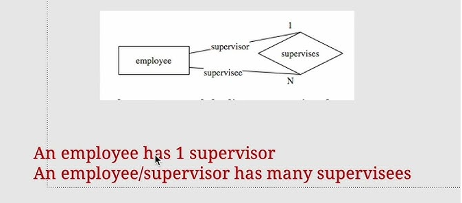
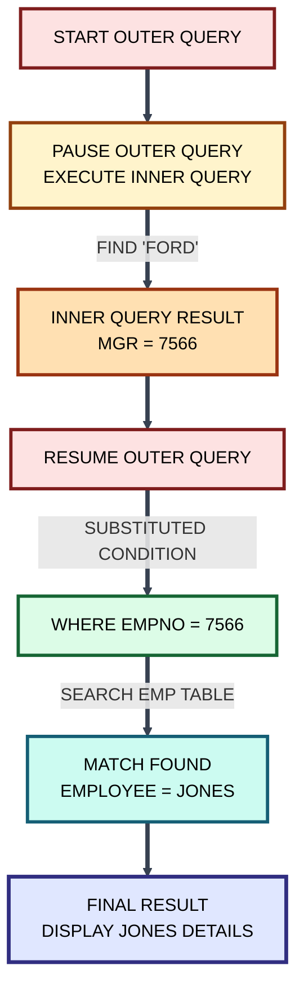
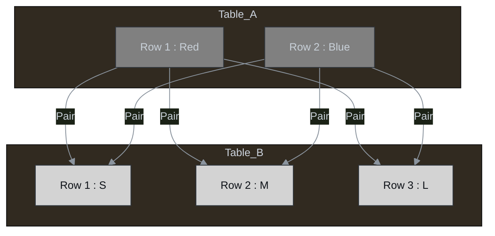

# 🗄️ Master Guide: Advanced Subquery Operators & Joins

<div align="center">


</div>

<hr style="border: 1px solid rgb(98, 117, 187)">

<div align="center">
<table>
<tr>
<td align="center">
<br />

<h3>© 2025 Avinash Dhanuka</h3>
<p>Master Guide: Joins & Advanced Logic</p>
<p><em>Crafted with ❤️ for Relational Algebra & Performance</em></p>

<a href="https://mail.google.com/mail/?view=cm&fs=1&to=avunashdhanuka@gmail.com&su=SQL%20Joins%20Query&body=🗄️%20Hello%20Avinash,%0D%0A%0D%0AMy%20name%20is%20[Your%20Name]%20and%20I%20have%20a%20doubt%20regarding%20Joins%20Execution.%0D%0A%0D%0A🔹%20Topic:%20[Cartesian/Inner/Outer]%0D%0A🔹%20Question:%20[Type%20your%20question]%0D%0A%0D%0AThank%20you!" target="_blank">


</a>
<br />
<br />
</td>
</tr>
</table>
</div>

> **Author's Note:** This guide covers the two pillars of complex data retrieval: **Multi-Row Comparison Logic** (Subquery Operators) and **Relational Merging** (Joins). We will explore how tables "talk" to each other internally.

---

## 📑 Table of Contents
1.  [Subquery Operators (ALL, ANY, SOME)](#1-subquery-operators-multi-row-comparison)
    -   [The ALL Operator (AND Logic)](#11-the-all-operator)
    -   [The ANY / SOME Operator (OR Logic)](#12-the-any--some-operator)
2. [Unary Relationship (or Recursive Relationship)](#2-the-employee-manager-relationship-hierarchy)
3.  [Introduction to Joins](#3-introduction-to-joins)
4.  [Cartesian Join (Cross Join)](#4-cartesian-join-cross-join)
    -   [Internal Execution (Nested Loop)](#-internal-execution-flow-nested-loop)
5.  [Inner Join (Equi-Join)](#5-inner-join-equi-join)
    -   [The Join Condition](#-execution-flow-step-by-step)
6.  [Natural Join](#6-natural-join)
7.  [Self Join (Table vs Itself)](#7-self-join)
8.  [Outer Joins (Left, Right, Full)](#8-outer-joins)
    -   [Oracle Legacy Syntax (+)](#84-oracle-legacy-syntax-)
9.  [Top Interview Questions](#9--top-interview-questions-advanced--tricky)

---

## 1. SUBQUERY OPERATORS (Multi-Row Comparison)

When a Subquery returns **multiple rows** (a list of values), standard operators like `=`, `>`, `<` fail because they cannot compare a single value X against a list $[Y, Z, A]$. We need special operators to handle this list.

### 1.1 The ALL Operator
**Definition:** The `ALL` operator compares a value to **every single value** returned by the subquery.
*   **Logic:** It behaves like the **AND** operator. The condition must be true for *Value 1* AND *Value 2* AND *Value 3*.

| Operator Logic | Meaning | Equivalent Logic |
| :--- | :--- | :--- |
| `> ALL (10, 20, 30)` | Greater than the **Maximum** | `> 30` |
| `< ALL (10, 20, 30)` | Less than the **Minimum** | `< 10` |
| `= ALL (10, 20, 30)` | Equal to **Every** value | *Logically impossible unless all values are identical* |

**Syntax:**
```sql
SELECT * FROM EMP 
WHERE SAL > ALL (SELECT SAL FROM EMP WHERE DEPTNO = 10);
```
*(Find employees who earn more than the highest paid person in Dept 10).*

---

### 1.2 The ANY / SOME Operator
**Definition:** The `ANY` (synonym `SOME`) operator compares a value to **at least one value** returned by the subquery.
*   **Logic:** It behaves like the **OR** operator. The condition is True if it matches *Value 1* OR *Value 2* OR *Value 3*.

| Operator Logic | Meaning | Equivalent Logic |
| :--- | :--- | :--- |
| `> ANY (10, 20, 30)` | Greater than the **Minimum** | `> 10` (If > 10, it is > 10 OR 20 OR 30) |
| `< ANY (10, 20, 30)` | Less than the **Maximum** | `< 30` |
| `= ANY (10, 20, 30)` | Equal to **Any** value | Same as `IN (10, 20, 30)` |

**Syntax:**
```sql
SELECT * FROM EMP 
WHERE SAL < ANY (SELECT SAL FROM EMP WHERE DEPTNO = 10);
```
*(Find employees who earn less than the highest paid person in Dept 10).*

---


## 2. THE EMPLOYEE-MANAGER RELATIONSHIP (HIERARCHY)

**Definition:** This is a special database scenario known as a **Unary Relationship** (or Recursive Relationship). It occurs when a table has a relationship with **itself**.

In the `EMP` table, an employee and their manager are both "Employees". They both reside in the same table structure.

<p align="center">
  
</p>

### 📊 The Reference Data (The EMP Table)
To understand the logic, we must look at the data first. Observe how the `MGR` column points back to the `EMPNO` column.

| EMPNO (PK) | ENAME | MGR (FK) | JOB |
| :--- | :--- | :--- | :--- |
| **7839** | **KING** | NULL | PRESIDENT |
| **7566** | **JONES** | 7839 | MANAGER |
| **7902** | **FORD** | 7566 | ANALYST |
| **7369** | **SMITH** | 7902 | CLERK |

*   **Logic Check:**
    *   **Smith (7369)** reports to **7902** (Ford).
    *   **Ford (7902)** reports to **7566** (Jones).
    *   **Jones (7566)** reports to **7839** (King).
    *   **King (7839)** reports to **NULL** (He is the Boss).

---

### 🕵️ When to Apply This Concept? (Identification)
You know you are dealing with an **Employee-Manager** or **Self-Referencing** problem when:

1.  **Single Table Source:** The question asks for details of two entities (e.g., a Worker and a Boss), but both exist in the **same table**.
2.  **Specific Keywords:** The question uses terms like:
    *   "Display details of his **Manager**..."
    *   "Who **reports to**..."
    *   "Who works **under**..."
    *   "List the **subordinates** of..."
3.  **Cyclic Logic:** You need to use the output of a column (e.g., `MGR`) as the input filter for the Primary Key (`EMPNO`).

---

### 2.1 SCENARIO 1: FINDING THE MANAGER (Bottom-Up)
**Requirement:** "Display the details of FORD's Manager."

**Logic Flow:**
1.  **Step 1 (Inner):** Ask Ford: "Who is your Manager?" (Check `MGR` column of Ford).
2.  **Step 2 (Outer):** Find the Person whose `EMPNO` matches that ID.

**The Query:**
```sql
SELECT * 
FROM EMP 
WHERE EMPNO = (SELECT MGR 
               FROM EMP 
               WHERE ENAME = 'FORD');
```

**🏭 Execution Flow:**




---

### 2.2 SCENARIO 2: FINDING SUBORDINATES (Top-Down)
**Requirement:** "Display the details of all employees reporting to KING."

**Logic Flow:**
1.  **Step 1 (Inner):** Find King's ID (`EMPNO`).
2.  **Step 2 (Outer):** Find all employees whose `MGR` column matches King's ID.

**The Query:**
```sql
SELECT * 
FROM EMP 
WHERE MGR = (SELECT EMPNO 
             FROM EMP 
             WHERE ENAME = 'KING');
```

**🏭 Internal Execution Step-by-Step:**
1.  **Inner Query:** Scans table for `ENAME = 'KING'`.
    *   Returns `EMPNO`: **7839**.
2.  **Outer Query Transformation:**
    *   `SELECT * FROM EMP WHERE MGR = 7839;`
3.  **Row-by-Row Scan:**
    *   Does Smith's MGR (7902) = 7839? **No.**
    *   Does Jones's MGR (7839) = 7839? **Yes.** $\rightarrow$ *Add Jones to result.*
    *   Does Ford's MGR (7566) = 7839? **No.**

---

### 2.3 SCENARIO 3: MULTI-LEVEL HIERARCHY (Grand-Manager)
**Requirement:** "Display details of SMITH's Manager's Manager."

**Logic:** This requires **Chain Dependency**.
*   Level 1: Find Smith's MGR ID (Ford).
*   Level 2: Find Ford's MGR ID (Jones).
*   Level 3: Find the details of that ID (Jones).

**The Query:**
```sql
SELECT * 
FROM EMP
WHERE EMPNO = (                         -- (3) Outer: Find details of Grand Boss
    SELECT MGR                  
    FROM EMP
    WHERE EMPNO = (                     -- (2) Middle: Find Boss of Boss
        SELECT MGR              
        FROM EMP
        WHERE ENAME = 'SMITH'           -- (1) Inner: Find Boss of Smith
    )
);
```

**🏭 Deep Dive Execution:**



```mermaid
graph LR

    A["INNER QUERY<br/>WHO IS SMITH'S BOSS ?"]
    -->|RETURNS EMPNO = 7902| B["MIDDLE QUERY<br/>WHO IS BOSS OF 7902 ?"];

    B -->|RETURNS EMPNO = 7566| C["OUTER QUERY<br/>WHO IS EMPNO 7566 ?"];

    C -->|FETCH ROW| D["FINAL RESULT<br/>EMPLOYEE = JONES"];

    %% =======================
    %% BOLD CONNECTORS
    %% =======================
    linkStyle default stroke:#374151,stroke-width:4px

    %% =======================
    %% DISTINCT COLOR PHASES
    %% =======================

    %% INNER MOST QUERY
    style A fill:#fde68a,stroke:#92400e,stroke-width:3px,color:#000

    %% MIDDLE QUERY
    style B fill:#fed7aa,stroke:#9a3412,stroke-width:3px,color:#000

    %% OUTER QUERY
    style C fill:#c7d2fe,stroke:#312e81,stroke-width:3px,color:#000

    %% FINAL OUTPUT
    style D fill:#e0e7ff,stroke:#1e3a8a,stroke-width:3.5px,color:#000
```

1.  **Level 1 (Inner):** `SELECT MGR WHERE ENAME='SMITH'` $\rightarrow$ Returns **7902**.
2.  **Level 2 (Middle):** `SELECT MGR WHERE EMPNO=7902` $\rightarrow$ Returns **7566**.
3.  **Level 3 (Outer):** `SELECT * WHERE EMPNO=7566` $\rightarrow$ Returns **JONES**.

---

## 3. INTRODUCTION TO JOINS

**Definition:** The process of retrieving data from **multiple tables simultaneously** is known as a Join. It is the mechanism that allows us to reconstruct a complete view of data that was split during the normalization process.

<p align="center">
  
</p>

### 🏗️ Why do we need Joins? (The Logic of Normalization)
RDBMS works on the principle of **Normalization** (Rule of One).
1.  **Redundancy Removal:** Instead of storing the "Department Name" (e.g., 'Accounting') 1000 times for 1000 employees, we store it **once** in a `DEPT` table with ID `10`.
2.  **Data Integrity:** If the Department name changes from 'Accounting' to 'Finance', we update it in one place (Dept Table), not 1000 places.
3.  **The Problem:** When we `SELECT * FROM EMP`, we only see `10`, not 'Accounting'.
4.  **The Solution (Joins):** Joins act as the "bridge" to fetch the Name from the Dept table using ID `10`.

### 🔑 How do we join tables? (The Foreign Key Concept)
To join two tables, there must be a logical relationship between them.
*   **Primary Key (PK):** The unique identifier in the Parent Table (e.g., `DEPTNO` in `DEPT` table).
*   **Foreign Key (FK):** The reference column in the Child Table (e.g., `DEPTNO` in `EMP` table).
*   **The Join:** We match `FK = PK`.

### 🔌 The `ON` Operator (The Connector)
The `ON` clause is specific to ANSI SQL. It defines **"How matching happens"**.
*   It separates the **Linkage Logic** from the **Filter Logic**.
*   **ON:** Defines the relationship (e.g., `Emp.DeptID = Dept.DeptID`).
*   **WHERE:** Defines the filter (e.g., `Salary > 5000`).

### 🌳 Types of Joins Hierarchy
1.  **Cartesian / Cross Join** (All to All)
2.  **Inner / Equi Join** (Only Matches)
3.  **Natural Join** (Automatic Match)
4.  **Self Join** (Match with itself)
5.  **Outer Join** (Match + Non-Match)
    *   Left Outer Join
    *   Right Outer Join
    *   Full Outer Join

---

## 4. CARTESIAN JOIN (CROSS JOIN)

**Definition:** In a Cartesian join, **every single record** of Table 1 merges with **all the records** of Table 2. It does not look for matches; it creates combinations.

*   **Mathematical Concept:** Cartesian Product ($A \times B$).
*   **Result Cardinality:**
    *   Table A Rows = $M$
    *   Table B Rows = $N$
    *   Output Rows = $M \times N$

<p align="center">
  
</p>
s

### 📜 Rules
1.  `No Join Condition ( Neither `ON` Nor `WHERE` ) is required.`
2.  If you forget the condition in a normal join, it accidentally becomes a **Cartesian join**.
3.  `**Columns are matched positionally**, ***not logically.***`

### 🏭 Internal Execution Flow (Nested Loop)
Imagine two tables: **Colors** (Red, Blue) and **Sizes** (S, M, L).

1.  **Step 1:** Engine picks **Row 1** from Table A ('Red').
2.  **Step 2:** Engine pairs 'Red' with **Row 1** of Table B ('S') $\rightarrow$ Output: `Red-S`.
3.  **Step 3:** Engine pairs 'Red' with **Row 2** of Table B ('M') $\rightarrow$ Output: `Red-M`.
4.  **Step 4:** Engine pairs 'Red' with **Row 3** of Table B ('L') $\rightarrow$ Output: `Red-L`.
5.  **Step 5:** Engine picks **Row 2** from Table A ('Blue') and repeats the loop.



### 📐 Syntax Comparison

| Style | Syntax |
| :--- | :--- |
| **ANSI (Standard)** | `SELECT * FROM Table1 CROSS JOIN Table2;` |
| **Oracle (Legacy)** | `SELECT * FROM Table1, Table2;` |

---

## 5. INNER JOIN (EQUI-JOIN)

**Definition:** It is used to obtain only the **Matching Records** from both tables. It filters out any row that does not find a partner in the other table.

*   **Logic:** Intersection ($\cap$).
*   **Requirement:** It requires a **Common Column** between the two tables to establish the link.


### 📊 Visualization with Tables

**Table 1: EMP (Child)**
| ENAME | DEPTNO (FK) |
| :--- | :--- |
| *SMITH* | **10** |
| *ALLEN* | **20** |
| *GHOST* | **99** |

**Table 2: DEPT (Parent)**
| DEPTNO (PK) | DNAME |
| :--- | :--- |
| **10** | *ACC* |
| **20** | *SALES* |
| **30** | *OPS* |

### 🏭 Execution Flow (Step-by-Step)
**Query:** Join EMP and DEPT on DEPTNO.

1.  **Row 1 (Smith, 10):**
    *   Engine looks at `DEPT` table. Does `10` exist?
    *   **Yes (ACC).** $\rightarrow$ **Join & Output:** `SMITH - ACC`.
2.  **Row 2 (Allen, 20):**
    *   Engine looks at `DEPT` table. Does `20` exist?
    *   **Yes (SALES).** $\rightarrow$ **Join & Output:** `ALLEN - SALES`.
3.  **Row 3 (Ghost, 99):**
    *   Engine looks at `DEPT` table. Does `99` exist?
    *   **No.** $\rightarrow$ **Discard Row.** (Inner Join only keeps matches).
4.  **Result:** 2 Rows returned. (Ghost and Dept 30/OPS are ignored).

### 📜 Rules & Condition Usage
1.  **Ambiguity Rule:** If a column name exists in both tables (e.g., `DEPTNO`), you **MUST** specify which table it belongs to using `Table.Column` (e.g., `EMP.DEPTNO`).
2.  **Alias Rule:** To save typing, give tables short nicknames (Aliases).
    *   `FROM EMP E, DEPT D` allows you to write `E.DEPTNO` instead of `EMP.DEPTNO`.
3.  **Data Type Rule:** The columns used in the `ON` condition must have compatible data types (e.g., Number vs Number).

### 🏭 The Join Condition Mechanism (`ON` Clause)
The "Join Condition" is the glue that filters the Cartesian product.
*   **Syntax:** `Table1.Column_Name = Table2.Column_Name`
*   **Purpose:** It tells the database *how* to line up the rows.

### 📐 Syntax Comparison

**1. ANSI Style (Recommended):**
Uses the `JOIN` keyword and `ON` clause. This is clearer because it separates logic.
```sql
SELECT E.ENAME, D.DNAME
FROM EMP E 
INNER JOIN DEPT D 
ON E.DEPTNO = D.DEPTNO;
```

**2. Oracle Style (Old School):**
Uses a comma and `WHERE` clause. This mixes join logic with filter logic.
```sql
SELECT E.ENAME, D.DNAME
FROM EMP E, DEPT D
WHERE E.DEPTNO = D.DEPTNO;
```
---


## 6. NATURAL JOIN

**Definition:** A specific type of Inner Join where the database **automatically** detects the join condition.
*   **Mechanism:** It looks for columns with the **Same Name** and **Same Data Type** in both tables and joins them.

### 📐 Syntax
```sql
SELECT * FROM EMP NATURAL JOIN DEPT;
```

### ⚠️ Characteristics & Risks
1.  **No `ON` Clause:** You cannot specify the condition; it is automatic.
2.  **Risk:** If tables have two common columns (e.g., `Manager_ID` and `Dept_ID`), it will try to join on **BOTH**, often resulting in zero rows.
3.  **Ambiguity:** You generally cannot use table aliases/prefixes on the joining columns.

---

## 7. SELF JOIN

**Definition:** Joining a table **to itself**.
*   **Scenario:** When a table contains a hierarchical relationship (e.g., Employee and Manager are both in the `EMP` table).
*   **Rule:** You **MUST** use **Table Aliases** (e.g., `E1` and `E2`) to treat the single physical table as two logical tables.

### 🖼️ Logic Visualization
*   **Table E1 (Employee):** Acts as the "Worker" table.
*   **Table E2 (Manager):** Acts as the "Boss" table.

### 📐 Syntax (ANSI)
```sql
SELECT Worker.ENAME AS "Employee", Boss.ENAME AS "Manager"
FROM EMP Worker
JOIN EMP Boss
ON Worker.MGR = Boss.EMPNO;
```

---

## 8. OUTER JOINS

**Definition:** Used to fetch Matching records **PLUS** Non-Matching records from one or both tables.

### 8.1 LEFT OUTER JOIN
*   **Logic:** Returns **ALL** records from the **Left Table** + Matching records from the Right Table.
*   **Non-Match:** If no match is found in the Right table, it returns `NULL`.

**Syntax (ANSI):**
```sql
SELECT E.ENAME, D.DNAME
FROM EMP E 
LEFT OUTER JOIN DEPT D 
ON E.DEPTNO = D.DEPTNO;
```

### 8.2 RIGHT OUTER JOIN
*   **Logic:** Returns **ALL** records from the **Right Table** + Matching records from the Left Table.

**Syntax (ANSI):**
```sql
SELECT E.ENAME, D.DNAME
FROM EMP E 
RIGHT OUTER JOIN DEPT D 
ON E.DEPTNO = D.DEPTNO;
```

### 8.3 FULL OUTER JOIN
*   **Logic:** Returns **Everything**. All from Left + All from Right.
*   **Result:** Matches are linked. Non-matches from either side get `NULL`.

**Syntax (ANSI):**
```sql
SELECT E.ENAME, D.DNAME
FROM EMP E 
FULL OUTER JOIN DEPT D 
ON E.DEPTNO = D.DEPTNO;
```

---

### 8.4 ORACLE LEGACY SYNTAX (+)
Before ANSI standards, Oracle used the `(+)` operator in the `WHERE` clause for Outer Joins. **It is placed on the side that is deficient (lacking data).**

*   **Left Join Equivalent:** (Right side is deficient)
    ```sql
    SELECT * FROM EMP E, DEPT D 
    WHERE E.DEPTNO = D.DEPTNO (+);
    ```
*   **Right Join Equivalent:** (Left side is deficient)
    ```sql
    SELECT * FROM EMP E, DEPT D 
    WHERE E.DEPTNO (+) = D.DEPTNO;
    ```
*   **Note:** The `(+)` operator cannot perform a Full Outer Join directly.

---


## 9. 🧠 TOP INTERVIEW QUESTIONS (Advanced & Tricky)

#### Q1: What happens if `WHERE ID IN (SELECT ID FROM ...)` returns a NULL?
> **Answer:** It works fine. The `IN` operator is equivalent to `= OR = OR =`. Since `val = NULL` is Unknown (False-ish), it just ignores the NULL and matches other values.

#### Q2: What happens if `WHERE ID NOT IN (SELECT ID FROM ...)` returns a NULL?
> **Answer:** **Logic Bomb!** The query returns **Zero Rows**.
> *   `NOT IN` translates to `!= AND != AND !=`.
> *   `ID != NULL` evaluates to **Unknown**.
> *   Since one part is Unknown, the entire `AND` chain becomes Unknown (False).
> *   **Fix:** Always add `WHERE ID IS NOT NULL` in the subquery.

#### Q3: Which is faster: `JOIN` or `SUBQUERY`?
> **Answer:**
> *   **Joins:** Generally faster for retrieving data from multiple tables because RDBMS engines are optimized for joining.
> *   **Subqueries:** Can be slower, especially **Correlated Subqueries** (which run N times). However, modern optimizers often rewrite simple subqueries into joins internally.

#### Q4: If Table A has 10 rows and Table B has 10 rows, what is the Maximum and Minimum rows in an INNER JOIN?
> **Answer:**
> *   **Max:** 100 rows (If every row in A matches every row in B - effectively Cartesian).
> *   **Min:** 0 rows (If no IDs match).

#### Q5: Can a Primary Key contain a NULL value?
> **Answer:** **No.** A Primary Key is `UNIQUE + NOT NULL`.

#### Q6: Can a Foreign Key contain a NULL value?
> **Answer:** **Yes.** A Foreign Key can be NULL (e.g., The CEO has no Manager, so `MGR_ID` is NULL).

#### Q7: What is the difference between `UNION` and `UNION ALL`?
> **Answer:**
> *   `UNION`: Merges two sets and **removes duplicates** (Slower due to sorting).
> *   `UNION ALL`: Merges two sets and **keeps duplicates** (Faster, just appends).

#### Q8: How does `> ANY` differ from `> ALL`?
> **Answer:**
> *   `> ANY (...)`: Greater than the **Minimum** value in the list. (Easier to satisfy).
> *   `> ALL (...)`: Greater than the **Maximum** value in the list. (Harder to satisfy).

#### Q9: Why did my `NATURAL JOIN` return zero rows when I know IDs match?
> **Answer:** `NATURAL JOIN` joins on **ALL** columns with the same name.
> *   If Table A has `(ID, Name)` and Table B has `(ID, Name)`.
> *   It tries `A.ID = B.ID AND A.Name = B.Name`.
> *   If IDs match but Names differ, the row is rejected. This is why explicit `INNER JOIN` is preferred.

#### Q10: Can we perform an Outer Join in a Self Join scenario?
> **Answer:** **Yes.**
> *   *Scenario:* List all employees and their managers, including the CEO (who has no manager).
> *   *Query:* `SELECT E.Name, M.Name FROM Emp E LEFT JOIN Emp M ON E.Mgr = M.EmpID`.

#### Q11: What is a "Mutating Table Error" in Subqueries?
> **Answer:** This occurs (specifically in Triggers) when you try to select from the **same table** you are currently updating. The database locks the table state and forbids a subquery from reading it mid-change.

#### Q12: Is it possible to join a table with no common column?
> **Answer:** **Yes.** A `CROSS JOIN` (Cartesian Product) does not require a common column.

#### Q13: What does `SELECT * FROM T1, T2` do if I forget the WHERE clause?
> **Answer:** It performs a **Cartesian Join** (Cross Join), combining every row of T1 with every row of T2, likely crashing the application if tables are large.

#### Q14: How do you delete duplicate rows but keep one? (Using logic from this topic)
> **Answer:** Use a Subquery with `ROWID` (Oracle) or `CTID` (Postgres).
> `DELETE FROM Table WHERE rowid NOT IN (SELECT MAX(rowid) FROM Table GROUP BY id);`

#### Q15: If I have a composite Primary Key (Col A, Col B), how do I join it?
> **Answer:** The Join condition must match **both** columns.
> `ON T1.A = T2.A AND T1.B = T2.B`.

---

*Created for Advanced SQL Logic & Architecture.*
```