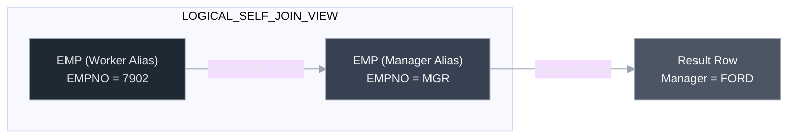
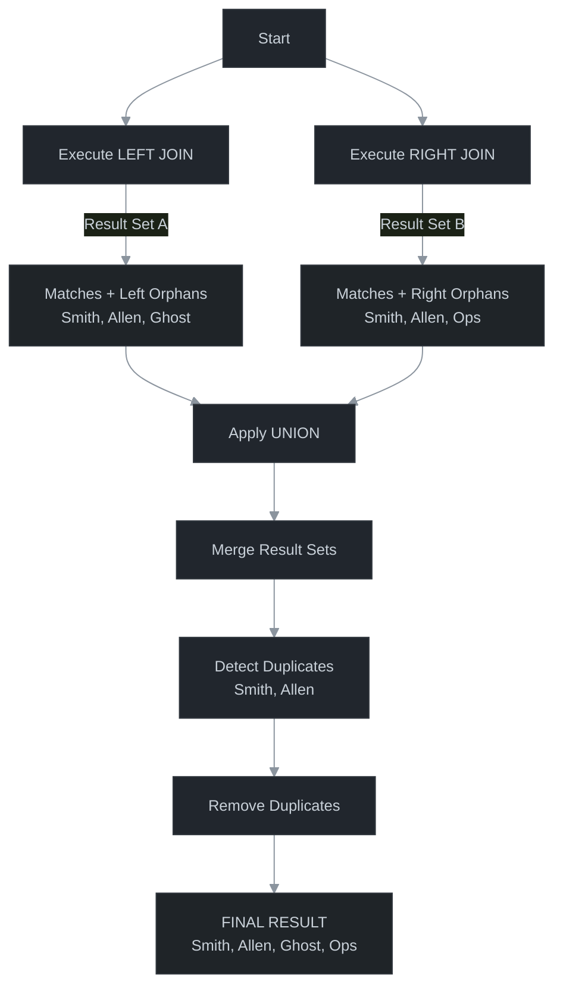
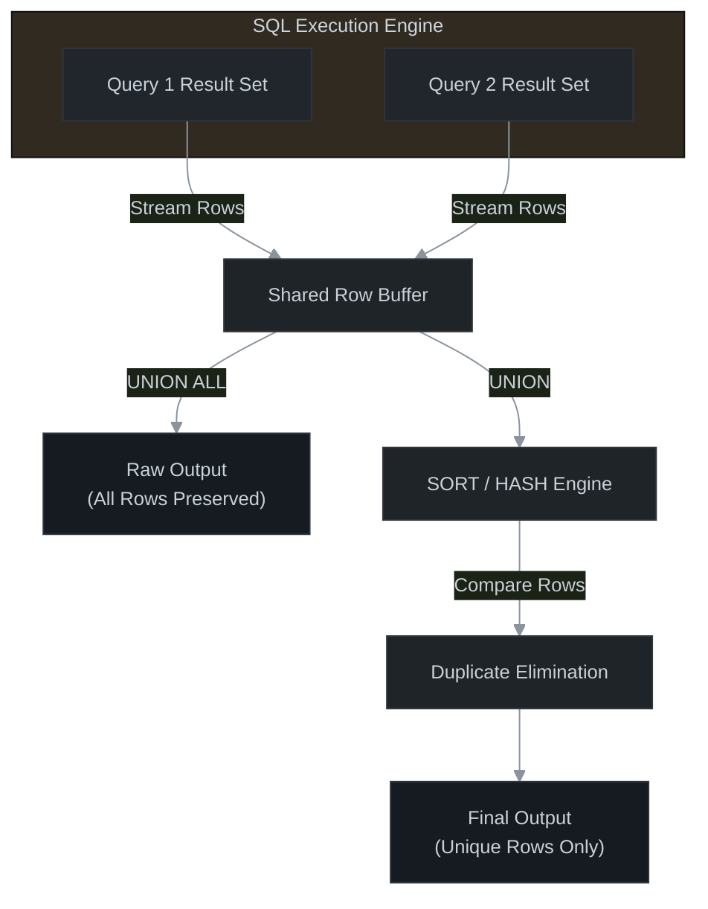
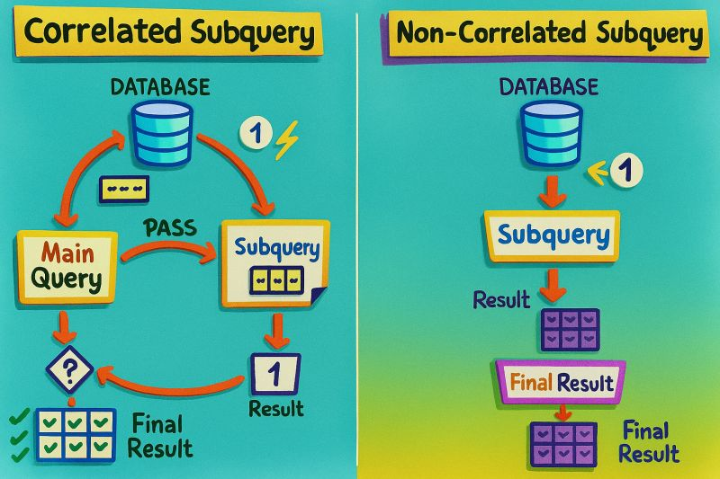
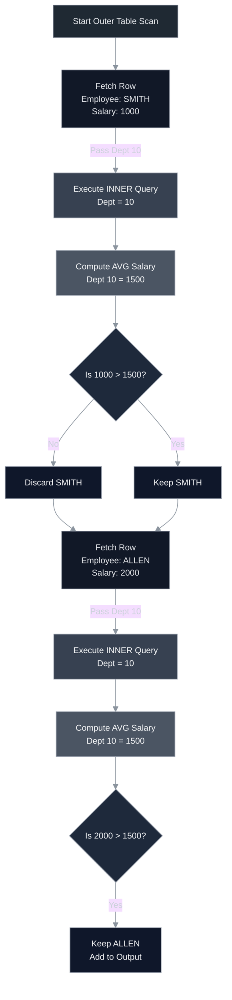

# 🗄️ Relational Mechanics: Advanced Joins, Set Theory & Correlated Logic

<div align="center">


</div>

<hr style="border: 1px solid rgb(98, 117, 187)">

<div align="center">
<table>
<tr>
<td align="center">
<br />

<h3>© 2026 Avinash Dhanuka</h3>
<p><b>Advanced Logic & Internal Execution Architecture</b></p>
<p><em>Optimized for High-Performance Query Engineering</em></p>

<a href="https://mail.google.com/mail/?view=cm&fs=1&to=avunashdhanuka@gmail.com&su=Technical%20Inquiry:%20Relational%20Mechanics%20&%20SQL%20Architecture&body=🗄️%20Hello%20Avinash,%0D%0A%0D%0AI%20am%20[Your%20Name],%20currently%20analyzing%20your%20'Relational%20Mechanics'%20architecture%20guide.%0D%0A%0D%0A🔹%20Topic%20of%20Interest:%20[e.g.,%20Correlated%20Logic%20/%20Set%20Theory]%0D%0A🔹%20Database%20Engine:%20[e.g.,%20Oracle,%20MySQL,%20Postgres]%0D%0A🔹%20Architectural%20Doubt:%20[Describe%20the%20specific%20logic%20conflict%20or%20execution%20issue]%0D%0A%0D%0AThank%20you!" target="_blank">


</a>
<br />
<br />
</td>
</tr>
</table>
</div>

> **Author's Note:** This guide dismantles the standard understanding of SQL. We move beyond simple queries into the **Relational Algebra** of Set Operators, the **Recursive Logic** of Self-Joins, and the **Iterative Computational Cost** of Correlated Subqueries.

---


## 📑 Table of Contents
1.  [SELF JOIN: Recursive Hierarchy Mapping](#1-self-join-recursive-joining)
2.  [OUTER JOINS: The Deficient Side Logic](#2-outer-joins-handling-unmatched-data)
    -   [MySQL Full Join Engineering](#24-the-mysql-full-join-workaround-deep-dive)
    -   [Oracle Legacy Syntax (+) Nuances](#25-oracle-legacy-syntax-)
3.  [SET OPERATORS: Vertical Result Merging](#3-set-operators-mathematical-merging)
    -   [Internal Sort-Merge: UNION vs UNION ALL](#31-union-vs-union-all-the-merger)
    -   [The Intersection & Exclusion Logic](#32-intersect-the-common-ground)
4.  [NUMERIC ARCHITECTURE: Precision & Logic](#4-numeric-functions-math-logic)
5.  [CORRELATED SUBQUERIES: The Execution Loop](#5-correlated-subqueries-the-loop)
    -   [Performance Benchmarking: Subquery vs Join](#52-correlated-subquery-vs-join-deep-comparison)
6.  [🧠 THE BURNER SERIES: 15 Mind-Blowing Interview Questions](#6--the-burner-series-15-mind-blowing-interview-questions)

---


## 1. SELF JOIN (Recursive Joining)

**Definition:** A Self Join is the mechanism of joining a table **to itself**.
*   **Concept:** It treats one physical table as **two logical tables** (clones) in the memory buffer.
*   **Requirement:** Since the table names are identical, you **MUST** use **Table Aliases** (e.g., `E1`, `E2`) to avoid ambiguity.

### 🕵️ When to use Self Join?
You use this when a table contains a **Unary (Recursive) Relationship**.
*   *Example:* An Employee and their Manager are both in the `EMP` table. To link them, we join `EMP` (as Worker) with `EMP` (as Boss).

### 📐 Syntax Comparison

| Style | Syntax |
| :--- | :--- |
| **ANSI (Standard)** | `SELECT E1.Col, E2.Col FROM Table1 E1 JOIN Table1 E2 ON E1.FK = E2.PK;` |
| **Oracle (Legacy)** | `SELECT E1.Col, E2.Col FROM Table1 E1, Table1 E2 WHERE E1.FK = E2.PK;` |

### 📊 The Data Scenario (Temporary Table)
Let's look at the raw data to understand the execution.

**Physical Table: EMP**
| EMPNO | ENAME | MGR |
| :--- | :--- | :--- |
| 7369 | **SMITH** | 7902 |
| 7902 | **FORD** | 7566 |
| 7839 | **KING** | NULL |

### 🏭 Internal Execution Flow (Step-by-Step)
**Query:** Display Worker Name and Manager Name.

```sql
SELECT W.ENAME AS Worker, M.ENAME AS Manager
FROM EMP W, EMP M 
WHERE W.MGR = M.EMPNO;
```

**Step 1: Logical Splitting**
The SQL Engine creates two virtual instances (aliases) of the table in memory.

**Virtual Table W (Worker)**
| W.EMPNO | W.ENAME | W.MGR |
| :--- | :--- | :--- |
| 7369 | SMITH | **7902** |
| 7902 | FORD | **7566** |

**Virtual Table M (Manager)**
| M.EMPNO | M.ENAME | M.MGR |
| :--- | :--- | :--- |
| **7902** | FORD | 7566 |
| **7566** | JONES | 7839 |

**Step 2: The Loop (Matching)**
1.  **Row 1 (Smith):**
    *   Check `W.MGR` (7902).
    *   Scan Table `M` for `EMPNO` = 7902.
    *   **Match Found:** FORD.
    *   *Output:* SMITH - FORD.
2.  **Row 2 (Ford):**
    *   Check `W.MGR` (7566).
    *   Scan Table `M` for `EMPNO` = 7566.
    *   **Match Found:** JONES.
    *   *Output:* FORD - JONES.
3.  **Row 3 (King):**
    *   Check `W.MGR` (NULL).
    *   Scan Table `M`. **No Match**.
    *   *Output:* Skipped (Inner Join behavior).




---


## 2. OUTER JOINS (Handling Unmatched Data)

**Definition:** Used to fetch Matching records **PLUS** Non-Matching (Orphan) records from one or both tables.

<p align="center">
  
</p>

### 📊 The Scenario Data (For All Outer Joins)

**Table A: EMP (Child)**
| ENAME | DEPTNO | Status |
| :--- | :--- | :--- |
| SMITH | 10 | Match |
| ALLEN | 20 | Match |
| **GHOST** | **99** | **No Parent** |

**Table B: DEPT (Parent)**
| DEPTNO | DNAME | Status |
| :--- | :--- | :--- |
| 10 | ACC | Match |
| 20 | SALES | Match |
| **30** | **OPS** | **No Child** |

---

### 2.1 LEFT OUTER JOIN
*   **Logic:** Returns **ALL** records from the **Left Table** (Driving Table) + Matching records from Right Table.
*   **Unmatched:** If no match is found in the Right table, the engine fills the columns with `NULL`.

#### 📐 Syntax Comparison

| Style | Syntax |
| :--- | :--- |
| **ANSI** | `SELECT * FROM EMP E LEFT JOIN DEPT D ON E.DEPTNO = D.DEPTNO;` |
| **Oracle (+)** | `SELECT * FROM EMP E, DEPT D WHERE E.DEPTNO = D.DEPTNO (+);` |

#### 🏭 Internal Execution Flow
1.  **Read Left (EMP):** Engine reads **Row 1 (Smith, 10)**.
    *   Check Right (DEPT): Is 10 there? **Yes (Acc)**. $\rightarrow$ Output `Smith - Acc`.
2.  **Read Left (EMP):** Engine reads **Row 2 (Allen, 20)**.
    *   Check Right (DEPT): Is 20 there? **Yes (Sales)**. $\rightarrow$ Output `Allen - Sales`.
3.  **Read Left (EMP):** Engine reads **Row 3 (Ghost, 99)**.
    *   Check Right (DEPT): Is 99 there? **No**.
    *   **Action:** Preserve "Ghost". Fill Dept details with `NULL`.
    *   Output `Ghost - NULL`.

---

### 2.2 RIGHT OUTER JOIN
*   **Logic:** Returns **ALL** records from the **Right Table** + Matching records from Left Table.
*   **Equivalence Rule (Important):** A Right Join is just a Left Join with the tables swapped.
    *   `A RIGHT JOIN B` is exactly the same as `B LEFT JOIN A`.
    *   *Industry Standard:* Most developers prefer using `LEFT JOIN` and just flipping table order for readability.

#### 📐 Syntax Comparison

| Style | Syntax |
| :--- | :--- |
| **ANSI** | `SELECT * FROM EMP E RIGHT JOIN DEPT D ON E.DEPTNO = D.DEPTNO;` |
| **Oracle (+)** | `SELECT * FROM EMP E, DEPT D WHERE E.DEPTNO (+) = D.DEPTNO;` |

#### 🏭 Internal Execution Flow
1.  **Read Right (DEPT):** Engine reads **Row 1 (10, Acc)**.
    *   Check Left (EMP): Any emp in 10? **Yes (Smith)**. $\rightarrow$ Output `Smith - Acc`.
2.  **Read Right (DEPT):** Engine reads **Row 2 (20, Sales)**.
    *   Check Left (EMP): Any emp in 20? **Yes (Allen)**. $\rightarrow$ Output `Allen - Sales`.
3.  **Read Right (DEPT):** Engine reads **Row 3 (30, Ops)**.
    *   Check Left (EMP): Any emp in 30? **No**.
    *   **Action:** Preserve "Ops". Fill Emp details with `NULL`.
    *   Output `NULL - Ops`.

> **Note:** The record "Ghost" (Dept 99) is **discarded** because `RIGHT JOIN` only cares about the Right Table (DEPT).

---

### 2.3 FULL OUTER JOIN (The Tricky One)
*   **Logic:** Returns **Everything**. All records from Left + All records from Right.
*   **Behavior:**
    1.  Matches are linked together.
    2.  Left-only records get `NULL` on the right.
    3.  Right-only records get `NULL` on the left.
*   **Supported By:** Oracle, PostgreSQL, SQL Server.
*   **❌ NOT Supported By:** **MySQL**. (MySQL does not recognize the keyword `FULL OUTER JOIN`).

#### 📐 Syntax Comparison

| Style | Syntax | Compatibility |
| :--- | :--- | :--- |
| **ANSI Standard** | `SELECT * FROM EMP E FULL OUTER JOIN DEPT D ON E.DEPTNO = D.DEPTNO;` | ✅ Oracle, Postgres, SQL Server <br> ❌ **Error in MySQL** |
| **Oracle (+)** | **Not Supported directly.** You cannot use `(+)` on both sides. | ❌ Error |

#### 🏭 Internal Execution Flow
The engine performs a union of the Left Join result and the Right Join result.

| ENAME | DEPTNO (E) | DNAME | DEPTNO (D) | Status |
| :--- | :--- | :--- | :--- | :--- |
| SMITH | 10 | ACC | 10 | Match |
| ALLEN | 20 | SALES | 20 | Match |
| **GHOST** | **99** | **NULL** | **NULL** | **Left Orphan** |
| **NULL** | **NULL** | **OPS** | **30** | **Right Orphan** |

---

### 2.4 THE MYSQL FULL JOIN WORKAROUND (Deep Dive)

**Since MySQL does NOT support `FULL OUTER JOIN`, we must engineer it manually.**

**The Logic:**
$$Full Join = (Left Join) \cup (Right Join)$$

**Critical Rule:** We must use `UNION` (which removes duplicates) instead of `UNION ALL`. If we use `UNION ALL`, the matching records (Smith, Allen) will appear **twice**.

#### 🏭 Internal Execution Flow Diagram
**Query (The Only Way in MySQL):**
```sql
SELECT * FROM EMP LEFT JOIN DEPT ON EMP.DEPTNO = DEPT.DEPTNO
UNION

SELECT * FROM EMP RIGHT JOIN DEPT ON EMP.DEPTNO = DEPT.DEPTNO;
```



---

### 2.5 ORACLE LEGACY SYNTAX (+)

Before ANSI standards, Oracle used the `(+)` operator.
*   **Rule:** The `(+)` is placed on the **Deficient Side** (the side that is missing data/has NULLs).
*   **Logic:** Think of `(+)` as saying "Please add NULLs here if you don't find a match".

#### 1. Left Join Equivalent
We want all **Left** data. The **Right** side might be deficient (missing).
```sql
SELECT * FROM EMP E, DEPT D 
WHERE E.DEPTNO = D.DEPTNO (+); 
-- (+) is on DEPT. So if EMP has 99, DEPT gets NULLs.
```

#### 2. Right Join Equivalent
We want all **Right** data. The **Left** side might be deficient.
```sql
SELECT * FROM EMP E, DEPT D 
WHERE E.DEPTNO (+) = D.DEPTNO;
-- (+) is on EMP. So if DEPT has 30, EMP gets NULLs.
```

> **⚠️ Limitation:** You cannot write `WHERE E.DEPTNO (+) = D.DEPTNO (+)`. This will throw `ORA-01468: a predicate may reference only one outer-joined table`.

--- 


## 3. SET OPERATORS (Mathematical Merging)

**Definition:** Set operators are used to combine the result sets of two or more `SELECT` statements into a single result set. Unlike Joins (which combine columns horizontally), Set Operators combine rows **vertically**.

<p align="center">
  
</p>

### 📜 The Golden Rules (Strict Validation)
The SQL Engine runs a validation phase before executing the query. If these rules are violated, an error (`ORA-01789` or similar) is thrown immediately.

1.  **Cardinality Rule (Column Count):** Both queries must select the **exact same number of columns**.
    *   *Invalid:* `SELECT A, B ... UNION SELECT A ...`
2.  **DataType Compatibility Rule:** The data type of corresponding columns must be **compatible** (not necessarily identical, but convertible).
    *   *Valid:* `SELECT Number ... UNION SELECT Decimal ...`
    *   *Invalid:* `SELECT Number ... UNION SELECT Date ...`
3.  **Ordering Rule:** The `ORDER BY` clause can **only** be placed at the very end of the final query. It sorts the combined result, not individual queries.
4.  **Column Names:** The final result set takes the column names from the **First** `SELECT` statement.

---

### 📊 DATA SCENARIO (For Examples)
To understand the output, let's assume two temporary tables: **A** and **B**.

**Table A (IDs)**: `{ 10, 20, 30, 30 }`  *(Note: 30 is duplicated)*
**Table B (IDs)**: `{ 30, 40, 50 }`

---

### 3.1 UNION vs UNION ALL (The Merger)

#### 📐 Syntax & Database Support

| Database | Syntax | Support |
| :--- | :--- | :--- |
| **ANSI / Oracle / SQL Server / MySQL** | `SELECT ... UNION [ALL] SELECT ...` | ✅ All Support Both |

#### 🏭 Internal Execution Flow (Step-by-Step)

**Scenario 1: UNION ALL (The Append)**
*   **Logic:** Simply appends Table B to Table A. No checks.
*   **Query:** `SELECT ID FROM A UNION ALL SELECT ID FROM B;`
*   **Result:** `{ 10, 20, 30, 30, 30, 40, 50 }` (7 Rows)
*   **Performance:** 🚀 **Very Fast** (No sorting, no overhead).

**Scenario 2: UNION (The Sort-Merge-Deduplicate)**
*   **Logic:** Appends $\rightarrow$ Sorts $\rightarrow$ Removes Duplicates.
*   **Query:** `SELECT ID FROM A UNION SELECT ID FROM B;`
*   **Result:** `{ 10, 20, 30, 40, 50 }` (5 Rows - Unique)
*   **Performance:** 🐢 **Slower** (Sorting cost is high).



#### 💡 Special Use Case: UNION for MySQL FULL JOIN
MySQL **does not** support the `FULL OUTER JOIN` keyword. We use `UNION` to simulate it.

*   **Concept:** Take all matching + left records (`LEFT JOIN`) **AND** all matching + right records (`RIGHT JOIN`).
*   **Why UNION?** Because both Left and Right joins include the "Matching" rows. `UNION` removes the duplicate matches. `UNION ALL` would show matching rows twice (wrong result).

**The Workaround Code:**
```sql
-- Simulate FULL OUTER JOIN in MySQL
SELECT * FROM EMP LEFT JOIN DEPT ON EMP.DEPTNO = DEPT.DEPTNO
UNION
SELECT * FROM EMP RIGHT JOIN DEPT ON EMP.DEPTNO = DEPT.DEPTNO;
```

---

### 3.2 INTERSECT (The Common Ground)

**Definition:** Returns only the rows that appear in **BOTH** result sets.

#### 📐 Syntax & Database Support

| Database | Syntax | Note |
| :--- | :--- | :--- |
| **Oracle / SQL Server / PostgreSQL** | `SELECT ... INTERSECT SELECT ...` | ✅ Native Support |
| **MySQL** | ❌ **Not Supported** | Must use `INNER JOIN` or `IN` clause. |

#### 🏭 Internal Execution with Data
*   **Data:** A=`{10, 20, 30, 30}`, B=`{30, 40, 50}`
*   **Logic:**
    1.  Engine identifies `30` is in A.
    2.  Engine identifies `30` is in B.
    3.  Engine discards 10, 20, 40, 50.
*   **Result:** `{ 30 }` (Distinct).

#### 🛠️ Real World Use Case: INTERSECT
*   **Scenario:** A bank wants to find customers who have **Both** a Savings Account AND a Credit Card.
*   **Query:**
    ```sql
    SELECT Cust_ID FROM Savings_Table
    INTERSECT
    SELECT Cust_ID FROM CreditCard_Table;
    ```

#### 🧠 Advanced Sub-Topic: INTERSECT ALL
Standard `INTERSECT` removes duplicates (returns distinct commons).
*   **`INTERSECT ALL`:** Keeps duplicates if they exist in both sets (e.g., if 30 appears twice in A and B, it returns 30 twice).
*   *Support:* PostgreSQL, DB2.

---

### 3.3 MINUS / EXCEPT (The Subtraction)

**Definition:** Returns rows found in the **First** query but **NOT** in the Second query.
*   *Formula:* $A - B$ (Elements in A, removing those that are also in B).

#### 📐 Syntax & Database Support

| Database | Syntax | Note |
| :--- | :--- | :--- |
| **Oracle** | `SELECT ... MINUS SELECT ...` | ✅ Native Support |
| **SQL Server / PostgreSQL** | `SELECT ... EXCEPT SELECT ...` | ✅ Native Support |
| **MySQL** | ❌ **Not Supported** | Must use `LEFT JOIN ... WHERE NULL` or `NOT IN`. |

#### 🏭 Internal Execution with Data
*   **Data:** A=`{10, 20, 30, 30}`, B=`{30, 40, 50}`
*   **Logic:**
    1.  Take A: `{10, 20, 30, 30}`.
    2.  Check against B: Is 30 in B? **Yes**. Remove it.
    3.  Is 10 in B? **No**. Keep it.
    4.  Is 20 in B? **No**. Keep it.
*   **Result:** `{ 10, 20 }`.

#### 🛠️ Real World Use Case: MINUS
*   **Scenario:** Find products that are listed in the Inventory but have **Never** been sold.
*   **Query:**
    ```sql
    SELECT Product_ID FROM Inventory
    MINUS
    SELECT Product_ID FROM Sales_History;
    ```

---


## 4. NUMERIC FUNCTIONS (Math Logic)

Used to manipulate numbers. Below is a detailed breakdown with syntax and examples.

### 🖼️ Visualizing the Number Line (Logic Anchor)
To understand Floor/Ceil with negative numbers, visualize this:
```text
<---(-11)---(-10.9)---(-10.1)---(-10)---(0)---(10)---(10.1)---(10.9)---(11)--->
    Smaller (Floor)                         Larger (Ceil)
```

### 📊 TEST DATA (For Examples)
Let's assume a dummy query: `SELECT Func(N) FROM DUAL;`

| Value A | Value B | Value C |
| :---: | :---: | :---: |
| `10.5` | `10.2` | `-10.8` |

---

### ⚙️ TRUNC vs TRUNCATE (The Confusion)
*   **`TRUNC(number)`:** Single Row Function. Cuts decimals.
*   **`TRUNCATE TABLE`:** DDL Command. Deletes all data. **Cannot be rolled back**.

### ⚙️ 1. ROUND (Mathematical Rounding)
**Logic:** Rounds to the *nearest* specified point.
*   $\ge 0.5$ $\rightarrow$ Up.
*   $< 0.5$ $\rightarrow$ Down.

**Syntax:** `ROUND(number, [decimal_places])`

| Input | Code | Result | Logic |
| :--- | :--- | :--- | :--- |
| `10.5` | `ROUND(10.5)` | **11** | .5 rounds up. |
| `10.4` | `ROUND(10.4)` | **10** | .4 rounds down. |
| `10.567` | `ROUND(10.567, 2)` | **10.57** | 3rd digit (7) > 5, so 2nd digit (6) becomes 7. |
| `10.567` | `ROUND(10.567, -1)` | **10** | Rounds before decimal point. |

---

### ⚙️ 2. TRUNC (Truncate Logic)
**Logic:** Simply **Cuts/Drops** the digits. It does not look at the next digit. It moves the number towards Zero.

**Syntax:** `TRUNC(number, [decimal_places])` (Oracle/Postgres) / `TRUNCATE(n, d)` (MySQL)

| Input | Code | Result | Logic |
| :--- | :--- | :--- | :--- |
| `10.999` | `TRUNC(10.999)` | **10** | Drops .999 entirely. |
| `10.567` | `TRUNC(10.567, 2)` | **10.56** | Keeps 2 decimals, drops the 7. |
| `-10.9` | `TRUNC(-10.9)` | **-10** | Moves towards zero. |

---

### ⚙️ 3. FLOOR (Downward Logic)
**Logic:** Returns the largest integer **less than or equal to** n.
*   **Visual:** Always jumps to the integer on the **Left** side of the number line.

**Syntax:** `FLOOR(number)`

| Input | Code | Result | Logic |
| :--- | :--- | :--- | :--- |
| `10.9` | `FLOOR(10.9)` | **10** | 10 is the integer to the left. |
| `-10.1` | `FLOOR(-10.1)` | **-11** | **Tricky!** -11 is smaller (left) than -10.1. |

---

### ⚙️ 4. CEIL / CEILING (Upward Logic)
**Logic:** Returns the smallest integer **greater than or equal to** n.
*   **Visual:** Always jumps to the integer on the **Right** side of the number line.

**Syntax:** `CEIL(number)` (Oracle) / `CEILING(number)` (SQL Server)

| Input | Code | Result | Logic |
| :--- | :--- | :--- | :--- |
| `10.1` | `CEIL(10.1)` | **11** | 11 is the integer to the right. |
| `-10.9` | `CEIL(-10.9)` | **-10** | **Tricky!** -10 is larger (right) than -10.9. |

---

### ⚙️ 5. MOD (Modulo / Remainder)
**Logic:** Returns the remainder of a division operation.
*   **Use Case:** Finding Even/Odd numbers (`MOD(n, 2) = 0`).

**Syntax:** `MOD(dividend, divisor)`

| Input | Code | Result | Logic |
| :--- | :--- | :--- | :--- |
| `10, 3` | `MOD(10, 3)` | **1** | $10 / 3 = 3$ with remainder **1**. |
| `10, 2` | `MOD(10, 2)` | **0** | $10 / 2 = 5$ with remainder **0**. |

---

### ⚙️ 6. ABS (Absolute Value)
**Logic:** Returns the positive version of a number (Distance from zero).

**Syntax:** `ABS(number)`

| Input | Code | Result | Logic |
| :--- | :--- | :--- | :--- |
| `-25` | `ABS(-25)` | **25** | Removes negative sign. |
| `25` | `ABS(25)` | **25** | Remains same. |

---

### ⚙️ 7. POWER & SQRT (Exponents)
**Logic:** Handles exponentiation and roots.

**Syntax:** `POWER(n, p)` and `SQRT(n)`

| Input | Code | Result |
| :--- | :--- | :--- |
| `2, 3` | `POWER(2, 3)` | **8** ($2 \times 2 \times 2$) |
| `25` | `SQRT(25)` | **5** ($5 \times 5 = 25$) |

---

### ⚙️ 8. SIGN (Positive/Negative Check)
**Logic:** Returns the sign of a number.

**Syntax:** `SIGN(number)`

| Input | Result | Meaning |
| :--- | :--- | :--- |
| **-50** | **-1** | Number is Negative |
| **0** | **0** | Number is Zero |
| **50** | **1** | Number is Positive |

---


## 5. CORRELATED SUBQUERIES (The Loop)

**Definition:** A Correlated Subquery is a query nested inside another query where the **Inner Query uses values from the Outer Query**. Unlike a standard subquery which runs once, a correlated subquery executes repeatedly—**once for every single row** processed by the outer query.

*   **Analogy:** Think of a **Nested For-Loop** in programming.
    *   *Standard Subquery:* Calculate a value `X` once, then use `X` everywhere.
    *   *Correlated Subquery:* For every item `i` in the list, calculate a specific value `Y` based on `i`.

<p align="center">
  
</p>

### 📜 Rules & Characteristics
1.  **Dependency Rule:** The Inner Query **cannot** run independently. If you try to highlight and run just the inner code, it will fail because it references a column from the Outer table (the "Correlation Variable").
2.  **Alias Rule:** You **MUST** use Table Aliases (e.g., `E1`, `E2`) to distinguish between the instance of the table in the Outer query vs. the Inner query.
3.  **Performance Cost:** It has **$O(N \times M)$** complexity. If the Outer table has 1,000 rows, the Inner query runs 1,000 times. It is generally slower than Joins for large datasets.
4.  **Scope:** The Inner query can see columns from the Outer query, but the Outer query *cannot* see columns from the Inner query.

---

### 🏭 Internal Execution Architecture (The Loop Logic)

**The Scenario Data:**
Let's use a small dataset to trace the execution.

**Table: EMP**
| ROW_ID | ENAME | DEPTNO | SAL |
| :--- | :--- | :--- | :--- |
| 1 | **SMITH** | 10 | 1000 |
| 2 | **ALLEN** | 10 | 2000 |
| 3 | **WARD** | 20 | 3000 |

**The Query:** Find employees earning more than the average of **their own** department.
```sql
SELECT E1.ENAME, E1.SAL, E1.DEPTNO
FROM EMP E1 
WHERE SAL > (
    SELECT AVG(SAL) 
    FROM EMP E2 
    WHERE E2.DEPTNO = E1.DEPTNO  -- <--- The Connection
);
```

#### 🔄 Step-by-Step Execution Flow

1.  **START OUTER QUERY:** The engine picks the **First Row** (SMITH).
    *   *Current Variables:* `E1.ENAME = SMITH`, `E1.SAL = 1000`, `E1.DEPTNO = 10`.
2.  **PAUSE OUTER:** The logic halts at the `WHERE` clause. It needs to solve the Subquery.
3.  **PASS VALUE:** It passes `10` (Smith's Dept) to the Inner Query.
4.  **EXECUTE INNER:** The Inner Query runs: `SELECT AVG(SAL) FROM EMP WHERE DEPTNO = 10`.
    *   Calculation: $(1000 + 2000) / 2 = 1500$.
    *   **Return:** `1500`.
5.  **RESUME OUTER:** The condition becomes: `WHERE 1000 > 1500`.
    *   Result: **FALSE**.
    *   *Action:* Discard SMITH.
6.  **NEXT ROW:** The engine picks the **Second Row** (ALLEN).
    *   *Current Variables:* `E1.DEPTNO = 10`, `E1.SAL = 2000`.
7.  **REPEAT LOOP:** Inner Query runs again for Dept 10.
    *   Return: `1500`.
    *   Condition: `2000 > 1500`.
    *   Result: **TRUE**.
    *   *Action:* **Keep ALLEN**.




---

### 5.1 The `EXISTS` and `NOT EXISTS` Operators
These operators are designed specifically for Correlated Subqueries.

*   **Logic:** They do **not** return a value. They return a **Boolean (True/False)**.
*   **Performance:** `EXISTS` is faster than `IN` for large subqueries because it stops scanning as soon as it finds **one match**.

**Example:** Find Departments that have at least one Employee.
```sql
SELECT * FROM DEPT D
WHERE EXISTS (
    SELECT 1            -- We don't care what column is selected
    FROM EMP E 
    WHERE E.DEPTNO = D.DEPTNO
);
```
*   **Flow:** For every Dept, check EMP table. If even *one* row matches, return TRUE and stop checking that Dept.

---

### 5.2 Correlated Subquery vs. JOIN (Deep Comparison)

Often, a Correlated Subquery can be rewritten as a JOIN for better performance.

#### ⚔️ Comparison Table

| Feature | Correlated Subquery | JOIN (Inner/Outer) |
| :--- | :--- | :--- |
| **Logic** | Iterative (Looping) | Set-based (Matrix Operation) |
| **Execution** | Runs $N$ times (once per row) | Runs once (optimized by engine) |
| **Readability** | Easier for "Existence" checks | Harder for complex filtering |
| **Performance** | Slower on large data | Generally Faster |

#### 🔄 How to Rewrite?
**Correlated Version:**
```sql
SELECT * FROM EMP E1 
WHERE SAL > (SELECT AVG(SAL) FROM EMP E2 WHERE E2.DEPTNO = E1.DEPTNO);
```

**JOIN Version (Optimized):**
1.  Calculate averages in a subquery (Derived Table).
2.  Join original table with the averages.
```sql
SELECT E1.* 
FROM EMP E1
JOIN (SELECT DEPTNO, AVG(SAL) as AvgSal FROM EMP GROUP BY DEPTNO) E2
ON E1.DEPTNO = E2.DEPTNO
WHERE E1.SAL > E2.AvgSal;
```
*   *Why is this faster?* The average is calculated **once** per department (3 times total), not once per employee (14 times).

---

### 5.3 Syntax Across Databases

The syntax for Correlated Subqueries is standard ANSI SQL and works identical in all major systems.

| Database | Syntax Support |
| :--- | :--- |
| **Oracle** | Fully Supported. Uses standard Aliases. |
| **MySQL** | Fully Supported. Optimizes `EXISTS` well. |
| **PostgreSQL** | Fully Supported. |
| **SQL Server** | Fully Supported. |

**General Syntax:**
```sql
SELECT outer_column
FROM table_outer Alias1
WHERE column_operator (
    SELECT inner_column
    FROM table_inner Alias2
    WHERE Alias1.col = Alias2.col -- Correlation
);
```

---

### 📊 Comparison Summary: Subquery vs Correlated

| Parameter | Normal Subquery | Correlated Subquery |
| :--- | :--- | :--- |
| **Execution Order** | Inner First $\rightarrow$ Outer Next | Outer First $\rightarrow$ Loop Inner |
| **Dependency** | Outer depends on Inner | **Both** depend on each other |
| **Independent Run** | Inner **can** run alone | Inner **cannot** run alone |
| **Executions** | Inner runs **Once** total | Inner runs **N times** |
| **Coupling** | Loosely Coupled | Tightly Coupled |
| **Best For** | Static lists / One-time calculations | Row-specific calculations / Hierarchies |

---


## 6. 🧠 THE BURNER SERIES: 15 Mind-Blowing Interview Questions

#### Q1: You perform a `LEFT JOIN` on two tables. Table A has 10 rows (one is `NULL`) and Table B has 0 rows. What is the row count of the result?
**Answer:** Exactly **10 rows**. A Left Join preserves all rows from the driving table (Left), filling the Right columns with `NULL`, regardless of whether the Right table is empty.

#### Q2: What happens if you use `NOT IN` with a subquery that returns at least one `NULL`?
**Answer:** The query returns **Zero rows**. This is a common "logic trap." Since `NULL` is unknown, SQL cannot confirm that a value is "Not In" a set that contains an unknown.

#### Q3: Does `EXISTS (SELECT 1/0 FROM EMP)` throw a "Division by Zero" error?
**Answer:** **No.** The `EXISTS` engine only checks for the *existence* of a row; it never evaluates the expressions in the `SELECT` list of the subquery.

#### Q4: If Table A has 5 rows with the value '1' and Table B has 5 rows with the value '1', how many rows result from an `INNER JOIN`?
**Answer:** **25 rows.** Joins work on Cartesian product principles per matching key. $5 \times 5 = 25$.

#### Q5: What is the primary performance difference between `UNION` and `UNION ALL` internally?
**Answer:** `UNION` triggers an internal **Sort and Distinct** operation to remove duplicates, which is CPU and memory-intensive ($O(N \log N)$). `UNION ALL` is a simple **Append** operation ($O(N)$).

#### Q6: Can you use a Correlated Subquery inside a `SELECT` clause?
**Answer:** **Yes.** This is called a **Scalar Subquery**. It executes once for every row in the result set to fetch a single value, but it can be a massive performance bottleneck.

#### Q7: In Oracle, why will `WHERE E.DEPTNO(+) = D.DEPTNO(+)` fail?
**Answer:** Oracle’s legacy `(+)` syntax does not support a "Full Outer Join" in a single predicate. You can only make one side deficient per condition.

#### Q8: `SELECT ROUND(1234.567, -2)`—What is the output?
**Answer:** **1200**. Negative precision rounds to the left of the decimal point (hundreds place).

#### Q9: If you `JOIN` two tables on a `NULL` column (e.g., `A.ID = B.ID` where both IDs are `NULL`), will those rows match?
**Answer:** **No.** In SQL, `NULL = NULL` is `UNKNOWN` (False). You must use `IS NULL` or `COALESCE` to match nulls.

#### Q10: How does `INTERSECT` handle multiple `NULL` values in both tables?
**Answer:** Set Operators (UNION, INTERSECT, MINUS) treat `NULL` as a **distinct value** for comparison purposes. If both tables have `NULL` rows, `INTERSECT` will return **one** `NULL` row.

#### Q11: Explain the difference between `TRUNCATE` and `DELETE` regarding the "High Water Mark" (HWM).
**Answer:** `DELETE` removes rows but keeps the HWM (the engine still scans the "empty" space). `TRUNCATE` resets the HWM, releasing the storage space back to the database.

#### Q12: Why is `EXISTS` generally faster than `IN` for a large subquery?
**Answer:** `EXISTS` uses **Short-Circuit Logic**. It stops scanning the inner table the moment it finds the *first* match. `IN` may (depending on the optimizer) collect all results from the subquery first.

#### Q13: What is the result of `SELECT COUNT(*)` vs `SELECT COUNT(column_name)`?
**Answer:** `COUNT(*)` counts every row including `NULLs`. `COUNT(column_name)` ignores `NULL` values in that specific column.

#### Q14: Can you use an `ORDER BY` clause inside a `UNION`'s first `SELECT` statement?
**Answer:** **No.** Global sorting can only happen once, at the very end of the entire set operation.

#### Q15: You have a self-join on an Employee table to find Managers. If "King" is the CEO (Manager ID is NULL), will King appear in the result of an `INNER JOIN`?
**Answer:** **No.** Because `NULL` (King's Mgr ID) cannot be joined to any `EMPNO`. To see King, you must use a `LEFT SELF JOIN`.

---
*Relational Mechanics Master Guide | © 2026 Avinash Dhanuka*