# 🗄️ Advanced Correlated Logic: Nth Highest/Lowest & String Manipulation

<div align="center">


</div>

<hr style="border: 1px solid rgb(98, 117, 187)">

<div align="center">
<table>
<tr>
<td align="center">
<br />

<h3>© 2026 Avinash Dhanuka</h3>
<p><b>Correlated Subquery Patterns & String Engineering</b></p>
<p><em>Mastering Ranking Logic Without Window Functions</em></p>

<a href="https://mail.google.com/mail/?view=cm&fs=1&to=avunashdhanuka@gmail.com&su=Technical%20Inquiry:%20Correlated%20Ranking%20Logic&body=🗄️%20Hello%20Avinash,%0D%0A%0D%0AI%20am%20[Your%20Name],%20exploring%20your%20Correlated%20Subquery%20ranking%20patterns.%0D%0A%0D%0A🔹%20Topic:%20[e.g.,%20Nth%20Highest%20/%20String%20Functions]%0D%0A🔹%20Database:%20[Oracle,%20MySQL,%20Postgres]%0D%0A🔹%20Question:%20[Your%20specific%20doubt]%0D%0A%0D%0AThank%20you!" target="_blank">


</a>
<br />
<br />
</td>
</tr>
</table>
</div>

> **Author's Note:** This guide explores the classical approach to finding Nth Highest/Lowest values using Correlated Subqueries—a technique that predates modern Window Functions but remains crucial for understanding SQL's computational logic and for databases that lack advanced analytical features.

---

## 📑 Table of Contents
1.  [The Nth Highest/Lowest Problem](#1-the-nth-highestlowest-problem)
    -   [The Core Logic: Counting Greater Values](#11-the-core-logic-counting-greater-values)
    -   [Fourth Highest Salary (Deep Dive)](#12-fourth-highest-salary-deep-dive)
2.  [Nth Minimum Salary Pattern](#2-nth-minimum-salary-pattern)
3.  [Range-Based Ranking (Multiple Positions)](#3-range-based-ranking-multiple-positions)
    -   [Fetching 4th AND 5th Maximum](#31-fetching-4th-and-5th-maximum)
    -   [Top N Records (First 5 Maximum)](#32-top-n-records-first-5-maximum)
4.  [Complex Ranking: Combining Max and Min](#4-complex-ranking-combining-max-and-min)
5.  [Department-Wise Ranking](#5-department-wise-ranking)
    -   [2nd Maximum Salary Per Department](#51-2nd-maximum-salary-per-department)
6.  [Conditional Filtering with Aggregates](#6-conditional-filtering-with-aggregates)
    -   [Above Average Salary (Global)](#61-above-average-salary-global)
    -   [Above Average Salary (Department-Wise)](#62-above-average-salary-department-wise)
7.  [String Manipulation Functions](#7-string-manipulation-functions)
    -   [SUBSTR/SUBSTRING: Extracting Substrings](#71-substrsubstring-extracting-substrings)
    -   [Character Counting with REPLACE](#72-character-counting-with-replace)
    -   [LENGTH and String Analysis](#73-length-and-string-analysis)
8.  [Introduction to DDL Commands](#8-introduction-to-ddl-commands)
    -   [CREATE TABLE with Constraints](#81-create-table-with-constraints)
    -   [RENAME TABLE Operation](#82-rename-table-operation)
    -   [Foreign Key Relationships](#83-foreign-key-relationships)
9.  [🧠 Advanced Interview Questions](#9--advanced-interview-questions)

---

## 1. THE NTH HIGHEST/LOWEST PROBLEM

**Definition:** Finding the Nth Highest or Lowest value is a classic SQL problem that tests your understanding of Correlated Subqueries and ranking logic. Before the introduction of Window Functions (RANK, DENSE_RANK, ROW_NUMBER), this was the standard approach.

### 🎯 The Business Scenario
*   **HR Analytics:** Find the 3rd highest paid employee for salary benchmarking.
*   **Sales Ranking:** Identify the 5th best-performing salesperson.
*   **Performance Review:** Determine employees in specific salary brackets.

---

### 1.1 THE CORE LOGIC: COUNTING GREATER VALUES

**The Fundamental Principle:**
To find the Nth Highest value, count how many DISTINCT values are GREATER than the current value. If exactly (N-1) values are greater, then the current value is the Nth Highest.

**Mathematical Formula:**
$$\text{Nth Highest} \iff \text{COUNT(DISTINCT values > current)} = N - 1$$

**Example Logic:**
*   **4th Highest:** Count = 3 (Three values are higher)
*   **1st Highest (Maximum):** Count = 0 (No values are higher)
*   **2nd Highest:** Count = 1 (One value is higher)

---

### 1.2 FOURTH HIGHEST SALARY (DEEP DIVE)

**The Query:**
```sql
SELECT E1.SAL
FROM EMP E1
WHERE 3 IN (
    SELECT COUNT(DISTINCT E2.SAL)
    FROM EMP E2
    WHERE E1.SAL < E2.SAL
);
```

### 📊 Sample Data for Execution Trace

**Table: EMP (Salary Column)**
| EMPNO | ENAME | SAL |
| :--- | :--- | :--- |
| 7839 | KING | **5000** |
| 7788 | SCOTT | **3000** |
| 7902 | FORD | **3000** |
| 7566 | JONES | **2975** |
| 7698 | BLAKE | **2850** |
| 7782 | CLARK | **2450** |

### 🏭 Internal Execution Flow (Step-by-Step)

**Step 1: Outer Query Picks First Row (KING, 5000)**
*   **Inner Query Executes:** Count how many DISTINCT salaries are > 5000.
*   **Scan:** Check all rows. No salary > 5000.
*   **Result:** COUNT = 0.
*   **Condition Check:** Is 3 IN (0)? **NO**.
*   **Action:** Discard KING.

**Step 2: Outer Query Picks Second Row (SCOTT, 3000)**
*   **Inner Query Executes:** Count DISTINCT salaries > 3000.
*   **Scan:** Only 5000 is greater.
*   **Result:** COUNT = 1.
*   **Condition Check:** Is 3 IN (1)? **NO**.
*   **Action:** Discard SCOTT.

**Step 3: Outer Query Picks Row (JONES, 2975)**
*   **Inner Query Executes:** Count DISTINCT salaries > 2975.
*   **Scan:** 5000, 3000 are greater.
*   **Result:** COUNT = 2 (DISTINCT: 5000, 3000).
*   **Condition Check:** Is 3 IN (2)? **NO**.
*   **Action:** Discard JONES.

**Step 4: Outer Query Picks Row (BLAKE, 2850)**
*   **Inner Query Executes:** Count DISTINCT salaries > 2850.
*   **Scan:** 5000, 3000, 2975 are greater.
*   **Result:** COUNT = 3.
*   **Condition Check:** Is 3 IN (3)? **YES**.
*   **Action:** **KEEP BLAKE (2850)**.

```mermaid
%%{init: {
  "theme": "base",
  "themeVariables": {
    "background": "#0d1117",
    "lineColor": "#8b949e",
    "primaryTextColor": "#000000",
    "fontSize": "13px"
  }
}}%%

graph TD

Start["Start: Scan EMP Table"]
    --> Row1["Fetch Row: SAL = 5000"]

Row1 -->|"Count > 5000"| Inner1["Inner Query<br/>COUNT = 0"]
Inner1 --> Check1{"Is 3 IN 0?"}
Check1 -- NO --> Discard1["Discard 5000"]

Discard1 --> Row2["Fetch Row: SAL = 3000"]
Row2 -->|"Count > 3000"| Inner2["Inner Query<br/>COUNT = 1"]
Inner2 --> Check2{"Is 3 IN 1?"}
Check2 -- NO --> Discard2["Discard 3000"]

Discard2 --> Row3["Fetch Row: SAL = 2975"]
Row3 -->|"Count > 2975"| Inner3["Inner Query<br/>COUNT = 2"]
Inner3 --> Check3{"Is 3 IN 2?"}
Check3 -- NO --> Discard3["Discard 2975"]

Discard3 --> Row4["Fetch Row: SAL = 2850"]
Row4 -->|"Count > 2850"| Inner4["Inner Query<br/>COUNT = 3"]
Inner4 --> Check4{"Is 3 IN 3?"}
Check4 -- YES --> Keep["✅ KEEP 2850<br/>4th Highest Found"]

%% Styling
classDef start fill:#1f2933,stroke:#6b7280,color:#e5e7eb;
classDef scan fill:#111827,stroke:#6b7280,color:#e5e7eb;
classDef inner fill:#374151,stroke:#9ca3af,color:#f9fafb;
classDef decision fill:#1e293b,stroke:#9ca3af,color:#f9fafb;
classDef discard fill:#7f1d1d,stroke:#9ca3af,color:#f9fafb;
classDef keep fill:#065f46,stroke:#9ca3af,color:#f9fafb;

class Start start
class Row1,Row2,Row3,Row4 scan
class Inner1,Inner2,Inner3,Inner4 inner
class Check1,Check2,Check3,Check4 decision
class Discard1,Discard2,Discard3 discard
class Keep keep
```




### 🔍 Why Use `DISTINCT` in COUNT?

**Without DISTINCT:**
If two employees have the same salary (e.g., SCOTT and FORD both earn 3000), the COUNT would be inflated.

**Example:**
*   Salaries: 5000, 3000, 3000, 2975, 2850
*   For 2850: Without DISTINCT, COUNT > 2850 = 4 (counts 3000 twice)
*   With DISTINCT: COUNT = 3 (counts 3000 once)

**Rule:** Always use `COUNT(DISTINCT ...)` for ranking queries to avoid duplicate counting.

---

## 2. NTH MINIMUM SALARY PATTERN

**Definition:** To find the Nth Minimum (Lowest), we reverse the logic: count how many DISTINCT values are SMALLER than the current value.

**Formula:**
$$\text{Nth Minimum} \iff \text{COUNT(DISTINCT values < current)} = N - 1$$

### 📐 Query: 5th Minimum Salary

```sql
SELECT E1.SAL
FROM EMP E1
WHERE 4 IN (
    SELECT COUNT(DISTINCT E2.SAL)
    FROM EMP E2
    WHERE E1.SAL > E2.SAL  -- Reversed: Count SMALLER values
);
```

### 🏭 Execution Logic

**For 5th Minimum:** We need exactly 4 values SMALLER than the current salary.

**Example:**
*   Salaries (Ascending): 800, 950, 1100, 1250, **1300**, 1500
*   For 1300: Count values < 1300 = 4 (800, 950, 1100, 1250)
*   **Result:** 1300 is the 5th Minimum.

---

## 3. RANGE-BASED RANKING (MULTIPLE POSITIONS)

### 3.1 FETCHING 4TH AND 5TH MAXIMUM

**Requirement:** Display both the 4th and 5th highest salaries in a single query.

**Logic:** Instead of checking for a single count, use `IN (3, 4)` to match multiple positions.

**Query:**
```sql
SELECT DISTINCT(E1.SAL)
FROM EMP E1
WHERE (SELECT COUNT(DISTINCT E2.SAL)
       FROM EMP E2
       WHERE E1.SAL > E2.SAL) IN (3, 4);
```

**Explanation:**
*   For 4th Max: 3 values are smaller (positions below it)
*   For 5th Max: 4 values are smaller
*   The query returns both

### 📊 Output Example

| SAL |
| :--- |
| 2450 |
| 2850 |

---

### 3.2 TOP N RECORDS (FIRST 5 MAXIMUM)

**Requirement:** Display the top 5 highest salaries.

**Logic:** Count how many values are GREATER. For top 5, we need counts 0, 1, 2, 3, 4.

**Query:**
```sql
SELECT DISTINCT(E1.SAL)
FROM EMP E1
WHERE (SELECT COUNT(DISTINCT E2.SAL)
       FROM EMP E2
       WHERE E1.SAL < E2.SAL) IN (0, 1, 2, 3, 4)
ORDER BY E1.SAL DESC;
```

**Breakdown:**
*   COUNT = 0: 1st Highest (Maximum)
*   COUNT = 1: 2nd Highest
*   COUNT = 2: 3rd Highest
*   COUNT = 3: 4th Highest
*   COUNT = 4: 5th Highest

---

## 4. COMPLEX RANKING: COMBINING MAX AND MIN

**Requirement:** Display the 3rd Maximum AND 4th Minimum salary in a single query.

**Logic:** Use `OR` to combine two separate correlated conditions.

**Query:**
```sql
SELECT DISTINCT(E1.SAL)
FROM EMP E1
WHERE 2 IN (SELECT COUNT(DISTINCT E2.SAL)
            FROM EMP E2
            WHERE E1.SAL < E2.SAL)  -- 3rd Max: 2 values greater
   OR 3 IN (SELECT COUNT(DISTINCT E2.SAL)
            FROM EMP E2
            WHERE E1.SAL >= E2.SAL);  -- 4th Min: 3 values smaller or equal
```

**Why `>=` for Minimum?**
When counting for minimum, we include the current value itself in the count to adjust the position logic.

---

## 5. DEPARTMENT-WISE RANKING

### 5.1 2ND MAXIMUM SALARY PER DEPARTMENT

**Requirement:** Find the 2nd highest salary in EACH department.

**Logic:** Add a department filter to the correlated subquery.

**Query:**
```sql
SELECT E1.DEPTNO, E1.SAL
FROM EMP E1
WHERE 1 IN (SELECT COUNT(DISTINCT E2.SAL)
            FROM EMP E2
            WHERE E1.SAL < E2.SAL 
              AND E1.DEPTNO = E2.DEPTNO);  -- Same Department
```

### 🏭 Execution Flow

**Step 1:** Outer picks Employee in Dept 10 with Sal 3000.
**Step 2:** Inner counts salaries > 3000 IN DEPT 10 ONLY.
**Step 3:** If count = 1, this is the 2nd highest in Dept 10.

### 📊 Output Example

| DEPTNO | SAL |
| :--- | :--- |
| 10 | 2450 |
| 20 | 2975 |
| 30 | 1600 |

---

## 6. CONDITIONAL FILTERING WITH AGGREGATES

### 6.1 ABOVE AVERAGE SALARY (GLOBAL)

**Requirement:** Display employees earning more than the overall average salary.

**Query:**
```sql
SELECT *
FROM EMP
WHERE SAL > (SELECT AVG(SAL) FROM EMP);
```

**Logic:**
*   Inner query calculates the global average (e.g., 2073).
*   Outer query filters employees with SAL > 2073.
*   This is a **Non-Correlated Subquery** (runs once).

---

### 6.2 ABOVE AVERAGE SALARY (DEPARTMENT-WISE)

**Requirement:** Display employees earning more than the average of THEIR OWN department.

**Query:**
```sql
SELECT E1.*
FROM EMP E1
WHERE E1.SAL > (SELECT AVG(E2.SAL) 
                FROM EMP E2
                WHERE E1.DEPTNO = E2.DEPTNO);
```

**Logic:**
*   For each employee, calculate the average of their department.
*   Compare their salary against that department average.
*   This is a **Correlated Subquery** (runs N times).

### 📊 Example

**Dept 10 Average:** 2916
*   KING (5000) > 2916 ✅ Include
*   CLARK (2450) < 2916 ❌ Exclude

---

## 7. STRING MANIPULATION FUNCTIONS

### 7.1 SUBSTR/SUBSTRING: EXTRACTING SUBSTRINGS

**Definition:** Extracts a portion of a string based on position and length.

**Syntax:**
```sql
SUBSTR(string, start_position, [length])
SUBSTRING(string, start_position, [length])
```

**Database Support:**

| Database | Function Name | Notes |
| :--- | :--- | :--- |
| Oracle | `SUBSTR` | Standard |
| MySQL | `SUBSTR` or `SUBSTRING` | Both work |
| PostgreSQL | `SUBSTR` or `SUBSTRING` | Both work |
| SQL Server | `SUBSTRING` | Only this variant |

### 📐 Examples

**Example 1: Extract from Position 1**
```sql
SELECT SUBSTR('SQL Tutorial', 1) AS ExtractString;
```
**Output:** `SQL Tutorial` (Entire string)

**Example 2: Extract 5 characters starting from position 2**
```sql
SELECT SUBSTR('SQL Tutorial', 2, 5) AS ExtractString;
```
**Output:** `QL Tu`

**Example 3: Negative Indexing (From End)**
```sql
SELECT SUBSTR('SQL Tutorial', -5, 5) AS ExtractString;
```
**Output:** `orial` (Last 5 characters)

### 🔍 Position Logic

**Positive Index:** Counts from the start (1-based).
**Negative Index:** Counts from the end.

```text
String: S Q L   T u t o r i a l
Index:  1 2 3 4 5 6 7 8 9 10 11 12
Neg:   -12-11-10-9-8-7-6-5-4-3-2-1
```

---

### 7.2 CHARACTER COUNTING WITH REPLACE

**Requirement:** Count how many times a specific character appears in a string.

**Logic:**
1. Calculate original string length.
2. Remove all occurrences of the target character.
3. Calculate new length.
4. Difference = Count of that character.

**Formula:**
$$\text{Count} = \text{LENGTH(Original)} - \text{LENGTH(REPLACE(Original, Char, ''))}$$

### 📐 Query: Find Employees with Exactly 2 'L's in Name

```sql
SELECT *
FROM EMP
WHERE LENGTH(ENAME) - LENGTH(REPLACE(ENAME, 'L', '')) = 2;
```

### 🏭 Execution Example

**Employee: ALLEN**
*   Original: `ALLEN` → LENGTH = 5
*   After REPLACE: `AEN` → LENGTH = 3
*   Difference: 5 - 3 = 2 ✅ Match

**Employee: MILLER**
*   Original: `MILLER` → LENGTH = 6
*   After REPLACE: `MIER` → LENGTH = 4
*   Difference: 6 - 4 = 2 ✅ Match

---

### 7.3 LENGTH AND STRING ANALYSIS

**Function:** `LENGTH(string)` or `LEN(string)` (SQL Server)

**Purpose:** Returns the number of characters in a string.

**Example:**
```sql
SELECT ENAME, LENGTH(ENAME) AS NameLength
FROM EMP;
```

**Output:**

| ENAME | NameLength |
| :--- | :--- |
| SMITH | 5 |
| ALLEN | 5 |
| KING | 4 |

---

## 8. INTRODUCTION TO DDL COMMANDS

**Definition:** DDL (Data Definition Language) commands are used to define and modify database structures (tables, schemas, constraints).

### 📜 DDL Command Categories

| Command | Purpose |
| :--- | :--- |
| `CREATE` | Create new database objects |
| `ALTER` | Modify existing objects |
| `DROP` | Delete objects |
| `TRUNCATE` | Remove all data (structure remains) |
| `RENAME` | Change object names |

---

### 8.1 CREATE TABLE WITH CONSTRAINTS

**Query:**
```sql
CREATE TABLE CUSTOMER(
    CID INT PRIMARY KEY,
    CNAME VARCHAR(20) NOT NULL,
    CNO INT NOT NULL UNIQUE CHECK(LENGTH(CNO)=10) CHECK(CNO > 0),
    ADDRESS VARCHAR(50)
);
```

### 🔍 Constraint Breakdown

**1. PRIMARY KEY (CID)**
*   Ensures uniqueness and NOT NULL.
*   Creates an index automatically.
*   Only one per table.

**2. NOT NULL (CNAME)**
*   Column must have a value.
*   Cannot insert NULL.

**3. UNIQUE (CNO)**
*   No duplicate values allowed.
*   NULL is allowed (unless combined with NOT NULL).

**4. CHECK Constraints**
*   `CHECK(LENGTH(CNO)=10)`: Phone number must be exactly 10 digits.
*   `CHECK(CNO > 0)`: Must be positive.

---

### 8.2 RENAME TABLE OPERATION

**Syntax:**
```sql
RENAME TABLE old_name TO new_name;
```

**Example:**
```sql
RENAME TABLE CUSTOMER1 TO CUSTOMER;
```

**Database Support:**

| Database | Syntax |
| :--- | :--- |
| MySQL | `RENAME TABLE old TO new;` |
| Oracle | `RENAME old TO new;` |
| PostgreSQL | `ALTER TABLE old RENAME TO new;` |
| SQL Server | `EXEC sp_rename 'old', 'new';` |

---

### 8.3 FOREIGN KEY RELATIONSHIPS

**Definition:** A Foreign Key establishes a link between two tables, enforcing referential integrity.

**Query:**
```sql
CREATE TABLE PRODUCT(
    PID INT PRIMARY KEY,
    PNAME VARCHAR(20) NOT NULL UNIQUE CHECK(LENGTH(PNAME)>0),
    PDESCRIPTION VARCHAR(50),
    CUSTOMER_ID INT,
    FOREIGN KEY(CUSTOMER_ID) REFERENCES CUSTOMER(CID)
);
```

### 🔗 Relationship Logic

**Parent Table:** CUSTOMER (CID is Primary Key)
**Child Table:** PRODUCT (CUSTOMER_ID is Foreign Key)

**Rules:**
1. Cannot insert a CUSTOMER_ID in PRODUCT that doesn't exist in CUSTOMER.
2. Cannot delete a CUSTOMER if their CID is referenced in PRODUCT (unless CASCADE is set).
3. Foreign Key can be NULL (orphan records allowed).

### 📐 Join Query

```sql
SELECT *
FROM CUSTOMER 
INNER JOIN PRODUCT
ON CUSTOMER.CID = PRODUCT.CUSTOMER_ID;
```

---

## 9. 🧠 ADVANCED INTERVIEW QUESTIONS

#### Q1: What is the time complexity of finding Nth Highest using Correlated Subquery?
**Answer:** $O(N^2)$ where N is the number of rows. For each row in the outer query, the inner query scans all rows. This is why Window Functions (which are $O(N \log N)$) are preferred for large datasets.

#### Q2: Why do we use `DISTINCT` in the COUNT for ranking queries?
**Answer:** Without DISTINCT, duplicate salary values would be counted multiple times, inflating the count and producing incorrect rankings. DISTINCT ensures each unique value is counted only once.

#### Q3: Can you find the Nth Highest without using a subquery?
**Answer:** Yes, using Window Functions: `SELECT SAL FROM (SELECT SAL, DENSE_RANK() OVER (ORDER BY SAL DESC) as rnk FROM EMP) WHERE rnk = N;`

#### Q4: What happens if multiple employees have the same Nth Highest salary?
**Answer:** The query returns ALL employees with that salary value. If you want only one, add `LIMIT 1` or use `ROW_NUMBER()` instead of `DENSE_RANK()`.

#### Q5: How do you find the Nth Highest per group (e.g., per department)?
**Answer:** Add the grouping column to the correlation condition: `WHERE E1.DEPTNO = E2.DEPTNO` in the subquery.

#### Q6: What's the difference between `SUBSTR('ABC', -1)` in Oracle vs MySQL?
**Answer:** Both return the last character 'C'. Negative indexing works identically in both systems.

#### Q7: How do you count vowels in a name using SQL?
**Answer:** 
```sql
SELECT LENGTH(ENAME) - LENGTH(REPLACE(REPLACE(REPLACE(REPLACE(REPLACE(
    ENAME, 'A', ''), 'E', ''), 'I', ''), 'O', ''), 'U', '')) AS VowelCount
FROM EMP;
```

#### Q8: Can a CHECK constraint reference another table?
**Answer:** No. CHECK constraints can only reference columns in the same row. Use a TRIGGER for cross-table validation.

#### Q9: What's the difference between TRUNCATE and DELETE?
**Answer:**
*   `TRUNCATE`: DDL, cannot be rolled back, resets identity, faster, removes all rows.
*   `DELETE`: DML, can be rolled back, can use WHERE clause, slower, logs each row.

#### Q10: Can a Foreign Key reference a non-Primary Key column?
**Answer:** Yes, but the referenced column must have a UNIQUE constraint. However, best practice is to reference Primary Keys.

---

*Advanced Correlated Logic & String Engineering | © 2026 Avinash Dhanuka*
